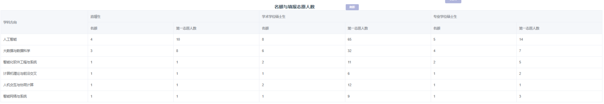
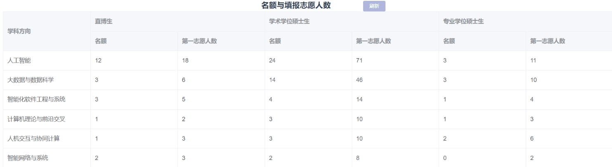

# 复旦计科

不知道为什么普遍认为华五中复旦的cs不是很强。但是[复旦NLP组](https://nlp.fudan.edu.cn/) 在国内非常强。

## 招生规模

## 招生形式

**夏令营难度极大（且基本只放rk1入营），多数人都是预推免上岸**

6月份报名，7月初夏令营。
8月份报名，9月份预推免。

## 细节

### 2021夏令营

考核方式采用机试+口试+专业面试

1. 机试没有使用OJ平台，使用pdf发题目给同学，一共三道题，都是leetcode easy和medium难度，使用本地IDE做完之后，附上解题思路和代码通过邮件发过去。
2. 口试是看着你提交的材料问的，一共两个老师，老师发音很标准，5分钟时间内会自我介绍，并且根据你的材料问问题。
3. 专业面试根据你所填报的方向，组织老师进行面试。我填的是人工智能专硕，报名的系统方向是NLP。首先问了一下我的科研，当时做的科研是GNN Backdoor Attack相关的内容，老师不咋感兴趣，老师问了一些NLP的问题，比如NLP有哪些任务，NLP有哪些评价指标，你知道预训练模型吗，讲一下BERT是怎么训练的。问了一道算法题，找第k小的数（快速选择/大顶堆），你最熟悉什么语言（Java，问了Java的垃圾回收）。

这里建议无论如何不要报专硕，虽然说是志愿优先，会保护志愿，但是老师似乎会给学硕打电话问要不要换成专硕（比较优秀，但是学硕又没名额了）。而且专硕没宿舍，学费又巨贵，不上也罢（有钱的话当我没说）。

### 2021预推免
复旦预推免报名挺早，我记得今年是9月5日开放报名，15日截止报名，18日通知初筛结果。  
预推免线上分2天进行。流程如下。

【第一天上午9:00-11:30机试】  
1.形式和夏令营一样，没有OJ平台，通过微信群发给你写有三道题目的PDF文件，两个半小时，做完后把写有解题思路和测试样例的PDF以及源代码通过邮件发回联络人。  
2.今年考察了图和动态规划，难度大概是CSP认证第二题或第三题的水平，基本能做出来。  
3.今年没用双机位，甚至没用前置摄像头，不知道之后会不会有。
  
【第一天下午 5分钟英语口试】  
1.自我介绍1分钟  
2.说一下研究经历  
3.介绍今后想要做的工作  
4.你认为AI学科最需要的技能是什么（我报的AI，应该跟你具体的方向有关）  
PS：英语口试的老师挺友善的，结束了好像还夸我说的不错..？找回了一点点自信。

【第二天晚上 15分钟综合面试】  
晚上面试，心态比较微妙，好像放下了戒备呢...  
（1）项目面试  
1.项目中模型的工作方式、原理，和实际业务的关系  
2.因为是开的公司，所以问了我们的盈利模式、业务流程  
3.项目中遇到的困难（老师认为可能出现的困难）  
PS：老师似乎还担心公司的工作会影响读研..好在我们暑假完成了股权转让orz
  
（2）专业面试  
1.说三个排序算法的时间复杂度  
2.昨天机试为啥没做出来某道题。所以机试后最好再想想该咋做。

【第三天本该有的 实验室面试】  
本人在专业面试没过所以没有进入到最后的实验室面试环节。我还觉得自己发挥的不错...按照联系的导师的说法，会在综合面试之后进行实验室面试，大概会问得更深更难吧。
  
其他：  
1.持续时间  
复旦计科应该是预推免里战线拉得最长的吧..？这两天里由于我海投，很多面试冲突了，当时都放弃了一两所学校。我现在觉得当时应该放弃复旦的，因为自己心里其实也知道去复旦希望不大，如果放弃复旦还能多点时间准备华师的面试...
虽然每天的测试内容都不多，但你要排队等待，所以其实很难在这期间准备其他学校面试的。最好早些做出取舍。  
2.面试系统  
系统有点拉胯，我用的时候画面模糊，声音听不太清，综合面试的时候还临时换成腾讯会议了，等了好久。顺序靠抽号，一般来说越晚抽号就越晚面试，所以还是有办法操作一下自己的面试时间以免冲突的。  
3.强committee  
我当时在群里认识了一个大佬，他本来都和导师在复旦畅谈未来了，结果最后可能是因为双非的缘故综合面试进了waiting list...不知道最后等到offer没有。所以暂且归入强committee。  
4.预推免这么拉胯的经历肯定不是冠军的啦。

## 作者

[蔡冠宇](../zuo-zhe-lian-xi-fang-shi.md#蔡冠宇)
[吴南希](../zuo-zhe-lian-xi-fang-shi.md#吴南希)