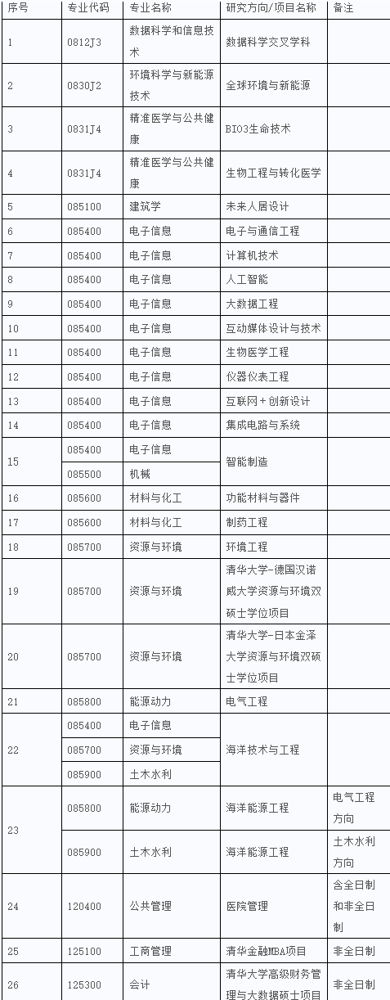

# 清华深圳

有很多项目，最热门的有CS、AI、大数据，其中AI和CS最卷，大数据会稍微简单一点。

清深这一块真的是实现清北title的梦想地，除了cs和ai，其他方面私以为和软微性质类似，但考虑到清深深圳位置实习优异，并且清深就业导向实习作为一项基本培养计划，很值得去。

## 招生规模

这个还是很重要的，之前稍微了解了一下，AI>CS>大数据。

## 招生形式

夏令营+预推免，系统中可以报名多个项目，但是只能面试一个，三个热门项目中大数据bar最低。

夏令营清华本科的同学不能报，预推免有很多清华本科的同学。

## 细节

### 2021夏令营大数据

入营60人，通过做项目筛出30人，这30人再面试，最后约剩10人通过面试，上岸。

考核方式：组队做项目+面试

进来要先组队做项目，一天半时间，做完后答辩，筛出30人，我和本校信安与大数据的同学组了一队，其实组队前已经明白，队长约等于保送面试，但是毕竟是一个学校的，我也没抢着当队长。我们做的是三维重建，总之就是拿了个开源代码，用几块显卡重建模型。我干的活还挺多的，最开始队长有点事，于是我先干起了队长的活（习惯了）。后面答辩后我被刷了，两位队友过了初筛。

总结出来的经验就是：评委其实对你一无所知，顶多来自提交的材料的一点信息，像这种做项目答辩的方式，一定要多展示自己，毕竟说出来，老师才知道。还有就是真的想上岸这里的，务必当队长。最后队里大数据的同学上岸了，毕竟是大数据的项目，专业对口还是有优势的。

虽然自己第一轮被筛了，但是也没太难过，毕竟两个队友过了。和两个妹子组队，多难得的机会呢:)

也恭喜上岸的同学了。

### 2021清深cs预推免

xlzz参加过清深cs预推免基本敲定offer，但由于去向的导师不是特别好，后面放弃了。

清深cs预推免难度其实要比夏令营难度大些，夏令营招的人数多很多，预推免的时候会有清本的过来参加（因为清本cser不允许报名清深夏令营），xlzz说到这里是有点后悔的，如果早点联系导师，现在或许成为好老师光荣的清计硕士er了，目前考虑的一个最佳实践是从夏令营就是报清深cs，没过预推免接着报，对于计科rk前三的，这样试能让自己上清华的几率最大化！又是清华又是计算机硕士，也算半个贵系，跟清软一个级别，不过导师和清软一样，特别厉害的老师数量比不过华五cs，也有好老师，需要尽早联系，夏树涛就很不错。考虑到清华能填写两个志愿，建议另一个报清软。

清深cs的生源真的很不错，中南计科基本都是3个以内过审，2021年只过我一个审，网上关于清深生源的问题更多的是关于非ai和cs的，其下线要高些。如果下届要报的话，只建议前三来报名。

【第一天 机试】
和贵系硕士一起联考机试，难度极大，基本都是中上题，题量与思维量显著高于清软，如果按照刷清软的程度去刷的话可能不太够，要想高分，需要往大模拟，图论这一块去靠近。xlzz考了100+，算中上，因此可以参加面试也能够基本拿到offer

【第二天 面试】
面试不好说，xlzz参加后觉得莫名其妙，老师竟是问你学校排名第几，给你offer来不来等问题，体感无语，面试体验不如清软。不过面试基本走过场感觉，要上清华的，请群发邮件轰炸！联系好老师！

面试的时候也会有一段论文翻译，如果能够有长达半年左右的论文阅读经验，基本算优异的。

清华计算机基本都是机试大头巨头（如果要考机试的话），强烈建议冲清华的，什么408不要看，直接无脑刷题！不要浪费时间看一分钟408，rk和机试到了基本稳录取了，只要不是贵系基本都这样！

## 作者

[蔡冠宇](../zuo-zhe-lian-xi-fang-shi.md#蔡冠宇)

[xlzz](../zuo-zhe-lian-xi-fang-shi.md)
email: 1789379064@qq.com
