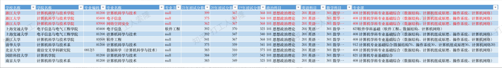

# 浙大计科

---
description: 'http://www.cs.zju.edu.cn/'
---

# 总体评价

浙大位于人间天堂“杭州”（生活压力较其它一线城市北京、上海小），其计科与软工实力均为A+，综合实力公认为全国top5以内。

浙计考研难度是也是全国公认的，被称为“炸大”，可以参考如下考研初试成绩图（如果是考研，极其不推荐来炸大）：

浙计的推免难度相较于考研来说，稍微低些（仅表现在初试入营内），复试的难度也有点大，以前浙大复试需要考pat，自从20年开始，浙大计科推免复试不再需要机试（可能以后又会需要），只需要进行20分钟的面试轰炸，xlzz有幸参加了浙大推免面试，私以为其面试很顶，不属于任何学校的面试。

与所有的清北华五直博一样，浙大的直博项目推免难度低很多，不过需要参加浙计直博夏令营才能有机会直博，基本上只要夏令营老师推荐你，你就能过了，往年直博录取生中，可以看到许多211的学生。

## 招生规模
待补充
## 招生形式

**夏令营只有直博，预推免有硕士和博士**

浙计是强com，只要参加了浙计的预推免，在过后几日会在钉钉群中公式所有考生的面试成绩，任何人放弃与否都需要在一百多人的群里进行确认，导师操作的权利很小。

## 细节

### 2021直博夏令营

未参加

### 2021预推免

浙大的预推免举办的很晚，一般是9.15号前报名，然后23或者24面试，最后卡在推免系统开的前几天出结果（buaa也喜欢卡在这个时间点出结果），如果想冲浙大，请一定要拿个其他学校的保底offer。

【第一天 上午近半小时的面试】  
1. 文件规定是不少于20分钟，我参加的这次面试近半个小时，最后进了浙大wl10+较靠前的位置（前面有一些去自动化所和清本的同学，所以我当时估计参照往年情况一定能录到），去年有补录到wl50+的位置。今年12点填系统，很多人不敢等，我在12点过十几分后就确定了自己拿到了录取名额，在下午2点以后，由于很多wl的都已经接受了保底学校的拟录取，因此都放弃了浙大的资格，好像几年排到了wl60+。
2. 面试最开始是2到3分钟的ppt个人介绍，和一分钟的英语陈述（可以说任何你想对老师说的话，我当时写的就是浙大 is my dream school，其实不是，贵系硕才是，狗头），后面开始老师提问。
3. 由于我没有acm也没有ccf-b以上的论文，所以我猜就算我面得再好也拿不到浙大计科学硕（浙计往年只录取了7个外校计科学硕，今年好像只有5个，难度很顶），后面果真验证如此，喜提wl。所以面试高分，一定要起点基调高，大三一定要恬不知耻的多蹭点论文，最好大一就acmer，（这种情况其实贵系硕和浙计硕你都任选了，贵系硕可能难度还要高些）。起点不高（类似于我这种三无选手），在包装后科研项目经历后，408一定要熟悉！
4. 我问的一些题目梳理如下：
        
        a.计网：请你就计网ipv4地址的三种划分方式以及如何路由进行分析。（传统abcd，subnet技术，以及无类域间路由方式，不断增强地址划分的灵活性，以及一些最长前缀匹配的算法，我答题的时候哪位老教授总不满意，我开始很绝望）
        b.哈希映射：什么是哈希，哈希冲突是什么？三种解决哈希冲突的方式（开放定址，拉链，再哈希）？如何理解开放？开放有哪些手段？平方探测，线性探测等。
        c.项目 介绍项目
        d.深度学习 解决过拟合和泛化问题？miou是什么？miou评价有什么缺陷？你有什么解决方法？深度学习网络中有许多参数量过大的情况，你如何解决？（我答的不好，应该有深度信念网络层次化训练，卷积参数共享以及移动设备卷积网络此类可分离卷积的方法，还有Inception用小卷积层叠代替大卷积，诸如受限玻尔兹曼机机器你也可以答出来一点点，我当时只答出来两点，气死，还是功力比不过那个年轻的老师）
        e.思政题 解释下校训
5. 喜提wl，听说浙大本校的在另一天面试，料想他们应该容易许多。听说有的组面试基本只问项目，为什么我这么顶，可能项目老师不喜欢？？
   
其他：  
1. 浙计的专硕我认为是华五专硕里面性价比最高的，其基本与学硕无任何差别，一样的寝室，一样的学费（只要7000，黑一波复旦专硕3.8w，狗头，个人觉得预推免浙大难度在华五是顶尖的），课程也差别不大。
2. 浙计好歹是A+，选择面高，去杭州实习，阿里巴巴出门右拐，我觉得去不了清软和贵系和信科，浙计是在计算机硕士方面不错的一个选择。

## 作者

[xlzz]( [来无影去无踪](zuo-zhe-lian-xi-fang-shi.md))
