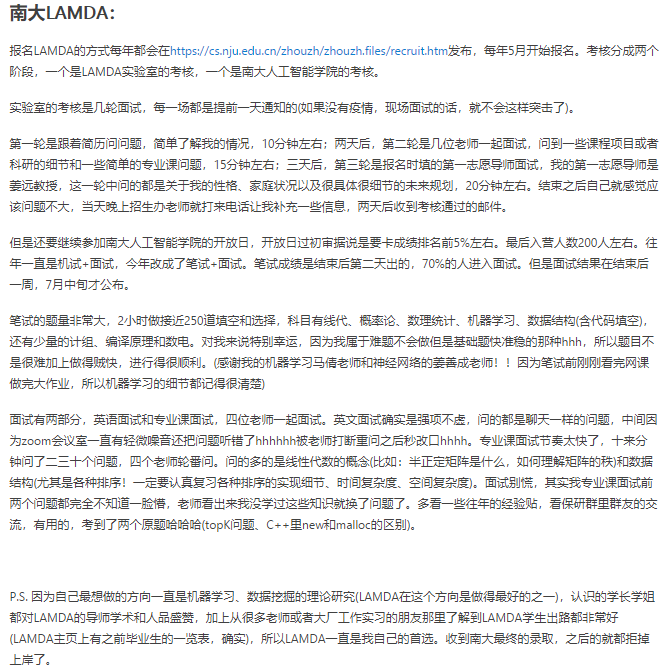
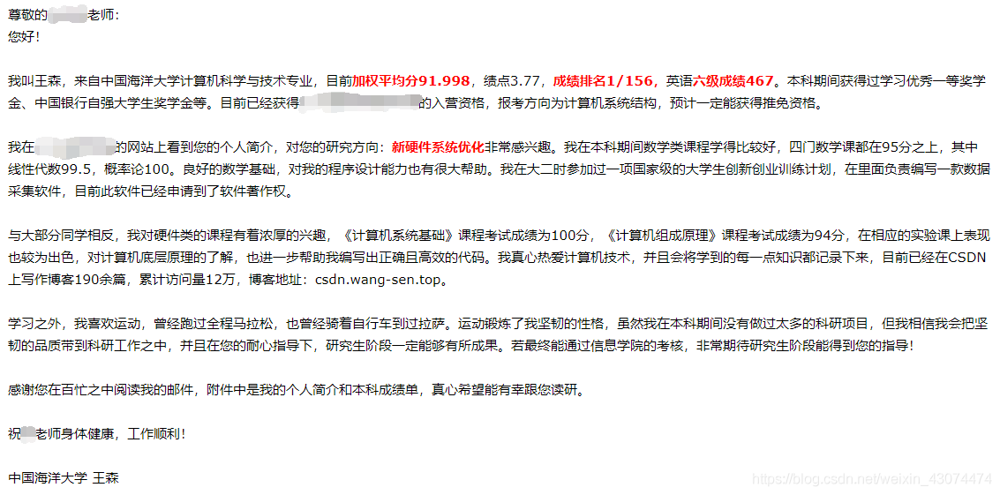

# 面经

# 清华软院

## [https://blog.csdn.net/mengwuyaaa/article/details/82918032](https://blog.csdn.net/mengwuyaaa/article/details/82918032)

清华大学软件学院
联系导师

清华大学软件学院我是完完全全奔L老师去的，非他不录，所以我给L老师发了邮件，大意为“我们能否提前谈谈，以此判断我参加夏令营有没有意义”。老师非常Nice，在夏令营的前一天带着他的整个组来和我约谈，用一个小时的时间，让我介绍了我论文的主要工作和贡献，并对实现和实验设置提问了一些细节，交流了方向的前景，也指出了可改进方向。巧合的是L老师近期的研究课题和我所研究问题的本质极其相似，希望很大。

唯一的问题应该在于在快要结束的时候，L老师问了我希望做科研还是工程，而我回答的是全身心地投入科研。然而L老师告诉我，我们这是一半工程一半科研，如果你确认加入的话需要考虑好这一点。我答应了。

机试

1.打印回文串（水题）

2.凸函数的三分求极值（水题）

3.没印象了（入门题）

4.最短路技巧题（走两次最短路记录最短路径按点累加，有一定技巧性）

群面面试

第二天面试（多面一）的时候老师会知道你的机试成绩，但是你自己不知道。面试问的问题十分随机，比如“你觉得你机试成绩怎么样了啊”、“能用英文来一段freestyle吗”等等（之前出来的同学说的）。我进去的时候先做了一段自我介绍，中间提了一下我的科研论文，然后底下老师全都抬头了。我介绍完之后一个老教授问，你的论文投到了xx？我说是。另一个年轻的老师问“你是第几作者？”“第一作者……共同第一作者。”然后若干老师眼睛一亮，开始疯狂发问。“这工作中你做了啥？”，“你为什么要做这个？”，“你只想做这个方向吗？”，“大的idea是谁出的？”，“论文中哪些部分是你写的？” …… 最后终于应付完了全部，长出一口气。

导师单面

群面过后要学生进入自己想进的实验室挑选导师。我就选了L导师的实验室，仔细一看，果然有二十几个学生想和我选同一个导师，在学生彼此了解之后，一部分学生退出竞争，选了别的老师，但剩下的对手还有将近十个。

坐在我左边的是个南大的同学，美赛的O奖。

而另一个发表过CCF C的上交的同学但表达能力有所欠缺。

我真正感受到压力的是同样A类顶会投稿中的双非大牛老王，他同时还拥有一篇SCI二区。

还有ACM金牌选手，L课题组已经开始实习的北航大牛钟爷爷。

以及一位清本自动化系的学生，一篇顶会二作待定（2弱收1弱拒）。

聊完之后就回去等结果了。

在这个期间，我同时参加了交叉信息研究院的夏令营。

## [https://www.cxyzjd.com/article/Scofield971031/101107300](https://www.cxyzjd.com/article/Scofield971031/101107300)

其实，来之前我慌的是机试，因为机试实在是太菜了，而且我很早就联系了老师，以为面试应该不成问题。但是分了五个组，老师随机分配，我联系的老师恰好在我隔壁，这就相当于全裸上阵纯靠自己，面试之前真的挺慌。

一共五组，每组11-12个同学，大概有5-6个老师，听说是每个所的老师都有一个，每人大概20分钟左右，面试顺序是根据报名号来的，随机分配的。

面试之前我准备的主要是2-3分钟的个人介绍（成绩+英语+竞赛+论文），还有准备了几门专业课（高数概率论+操作系统常见问题+数据库+计网），然后前一天晚上还想了想用英文介绍项目的部分。

进去之后，就首先给老师发简历，然后直接自我介绍2-3分钟，会有学姐记录，老师也会记录。说完之后老师就会轮流对着你简历问问题，我上来直接被问懵逼了。因为我简历上放了几门课的成绩，其中一门数字信号处理刚好没复习（-_-||），老师直接上来就问我专业问题，死亡三连问：1. 线性时不变因果系统是啥 2. 卡尔曼滤波是啥 3.讲讲巴特沃斯滤波的原理，细节真的回答不上来，就只能随便回答，气氛非常尴尬。。然后第二位老师接着问我有哪一门专业课觉得学得比较好的，为什么？因为我前一晚看过数据库，所以就说的数据库，然后就问我第二范式是啥，这个回答挺好的。第三个老师顺着下去问，问ACID是啥，我大概回答了下，隔离性和耐久性没记起来。第四个老师问的项目，然后最骚的是老师问我“不忘初心，牢记使命”是啥，我一脸懵逼，这是我凉了的节奏吗。然后就给他说中华民族伟大复兴等等，非常正直官方的回答了一下。最后一个老师突然蹦出来一个英文问题，让我用英文介绍一下在某项目里做了什么，这个回答的也还行，虽然那个项目没用英文准备过。

前前后后20分钟左右，由于上来专业问题回答的不好，真的感觉自己凉透了，出来之后人都是晕的。

## [https://blog.csdn.net/sherry_jy/article/details/78309698](https://blog.csdn.net/sherry_jy/article/details/78309698)

自我介绍3分钟（中文）

英文问题：what is the difference between network security and information security

你的母校也很好，为什么选择清华

有没有考虑过未来的方向

在竞赛中做了什么

有无读博打算

你的C语言和高数考的不好，为什么

结果在面试结束之后差不多一个礼拜会发到邮箱里。

## [https://blog.csdn.net/huhancsdn/article/details/70917153](https://blog.csdn.net/huhancsdn/article/details/70917153)

第一天机试结束后，第二天早上开始面试。我仔细观察了一下，应该机试还是刷掉一些人，因为硕士复试名单有60个人，而面试名单只有52个人。学长给我说过，清软机试必须作对一道题才算通过。面试之前个填志愿，就是你选择的专业，其实只有软件工程一个专业。面试是分组面试，老师人数大概6个左右。老师手里面也是有我们的机试成绩的。开始我用英语讲自己的论文大概5min，然后老师用英文问了我一些论文的问题。中文面试的时候，老师问我用什么语言比较多，我说java，我们专业没学过c++，然后老师老师问了一些java 和java ee的知识，问的没有多细，难度比一线互联网公司面试还是低一些。我先回答了他java 的异常处理和多线程的基础知识，讲了一下GC机制，然后解释了我自己对于Spring 框架的理解，比如我自己一直认为切向编程只是一个概念，没必要过多的关心，其实在很多地方都在普遍使用，比如servlet，balabala。然后我又说了spring的ioc其实有点类似中介，spring来负责控制对象的生命周期和对象间的关系，我们只需要告诉框架我们需要一个什么对象就行了，框架会帮我们维护这个对象，balabala。说了一会。一个老师问了我数学建模的模型，我讲了一下灰度关联分析模型。这个时候，一个老师拿着我本科的成绩单，对我说 “我看你计算机组成原理原理学得不错，问你一个机组的基础知识吧”，然后他叫我说出cpu一个指令周期流程，强调要像刚才我解释项目一样，说得详细点。这个时候我的心拔凉拔凉 ，机组是啥？早忘了，cpu指令周期可以吃吗？我支支吾吾说了两句，他一听，嘴角泛起笑意，我一看 哎，不行了，装不下去，算了 我投降。我直接说：“老师不好意思，我忘了”他说 没事 没事，行吧，又看了看我，你忘了正常，真没事。虽然他说没事，但我心里还是无数羊驼跑过，这下掺了。最后一个老师说“我们录取你的话。。。”话还没说完，他觉得他说的话那里不对，于是加了两个字“假如我们录取你的话，你想去那个所呢？”我说 其实哪个所都行。。。最后一个问题，一个老师拿着我填报的志愿说，同学你填报的是学术性硕士，但是学术性硕士因为名额只有一个，如果你录取不到学术性硕士，调剂到工程硕士你愿意么？我们的学硕和专硕是没有区别的。我一愣，什么鬼啊，我什么时候选的学硕啊，我说 没问题，当然愿意啊，非常愿意。然后老师微笑着告诉我面试结束了，我出来后等基友的时候，和旁边人聊天，发现其实昨天机试不少人都是只对了一道题，第二题 第三题都不敢保证自己作对了。这里插一句题外话，我们学院当时有三个人去清软复试，两个硕士 一个直博，直博的那个老哥在去之前老师就点头要他了，所以他基本就是走形式，去了30个直博复试。录取了28个，他说他机试不到20分，老师告诉他这个分不算倒数，注意直博的机试题要比硕士简单，所以可见其实机试还是有难度，我个人觉得比一些一线互联网公司秋招的机试题还是要难。

## [http://www.cskaoyan.com/thread-655284-1-1.html](http://www.cskaoyan.com/thread-655284-1-1.html)

面试会比笔试重要很多，所以在准备复试时一定不能只专注于准备笔试而忽视了对面试的准备。作为一个跨考生，这里我回忆一下老师问的我觉得对大家有参考价值的问题。

◎你觉得本科专业与软件工程的联系，并且说一下觉得自己需要弥补的地方（用英语提问的，同时也是第一个问题）

◎你在做这个项目的过程中最容易出错的地方（科班的一般会问你做项目时所解决过的最大的困难）

◎谈一下你对面向对象和面向过程的理解

◎作为跨专业的，你怎样提升自己的编码能力

◎你最近一次参加团建或者党建活动是多久，有什么感悟（软院每年的复试时间一般是两会刚结束的时候，很容易问到有关当年两会的问题）

剩下的老师问的问题是针对简历上我所写的，不具参考价值这里就不回忆了

## [https://www.cnblogs.com/jiading/articles/12675172.html](https://www.cnblogs.com/jiading/articles/12675172.html)

面试部分，英文是一问一答，然后是各种问，关于项目，科研，数学，计算机基础，可能都会问到。

## [https://postgraduate-recommendation.readthedocs.io/zh_CN/latest/schools/thu/ss.html#](https://postgraduate-recommendation.readthedocs.io/zh_CN/latest/schools/thu/ss.html#)

清华软院

[http://www.thss.tsinghua.edu.cn/](http://www.thss.tsinghua.edu.cn/)

比清华计科稍差一点，但是和清华计科在一个院楼上，如果导师还不错区别不大。我们院每年都会去比较多（常见3-5个）。

招生规模

外校硕士30人左右，外校博士10到20人。

**招生形式**

6月份会有夏令营（4月就会发报名通知，注意查看），夏令营和硕士招生完全无关，是博士夏令营。提供了一个校外学生和博导联系到机会，也不会直接发放offer。 但是考核形式和9月硕士博士招生完全类似，可以当作提前演练。 导师可能会给口头录取，到了9月还要走形式考试一次。

9月份预推免主要是硕士，初审相对严格，只有60个人可以通过参加考试，不过对我们院非常友好，大概前20名都有可能通过初审。过了初审之后通过的概率也很大。

**一些细节**

**2019**

1，夏令营2019年报名截止日期是4月30号，一定要提前留意通知。想直博必须去夏令营，而且最好联系老师。

2，夏令营入营学分绩最好前五（按前五学期排名），而且一般对我们院只会入营一个人

3，九推的通知八月中下旬出，在网上进行报名。一般年级排名15名之前都有机会过初审，前10名比较保险。

4，九推需要准备的材料是两封副教授推荐信，一份个人陈述（清华研招网上有模板），一份申请表（有模板），获奖证书复印件，六级成绩证明（6级越高越好，有比较高的托福雅思也可以放进来）

5，考核的形式是机考加面试。机考必须使用C++, 环境是vs2017，用机房电脑，3小时3道题。面试时长20分钟，会有五六个老师围着你问。

6，九推硕士过初审全国一共60人，我们院5人，九推大概会通过30到40人，我们院全部通过并且都选了清华。

7，清华出结果比较早，今年9月18日就出最终结果了，此时北大和浙大的九推还没出初审结果。

8, 竞赛表现好（有多个国家级比赛一等奖或者有ACM奖牌），或者科研表现好（有已经出版的论文且是一作或者二作）的人会在初审的时候有加分。最好有科研经历和项目经历，这样面试不会被问太多专业课知识。

9，面试有且只有一个英语问题，有的老师让你用英语解释项目，有的老师问专业知识（比如用英语解释一下快速排序之类的）

****2020****
1. 今年由于疫情影响，采用线上机考 + 面试的形式。机考 3 小时 4 道题，oj地址为 [https://dsa.cs.tsinghua.edu.cn/oj/](https://dsa.cs.tsinghua.edu.cn/oj/)，只能使用 C++（可以使用 C++ 11 的语法和 STL ），IDE 不限，不能查看任何形式的资料。面试时长 20 分钟。
2. 九推硕士过初审全国一共 58 人，最终通过 35 人，大概 60% 左右的通过率。我院 3 人全部通过。主要难点还是过简历初筛，而且今年因为疫情，九推开始的时候我院只有前五学期排名，会有一定程度的影响。
3. 还是因为疫情影响，今年 9 月 28 日出的结果。

**上机真题（硕士）**

2018年及以前请参考这篇博客 [https://blog.csdn.net/da_kao_la/column/info/27610](https://blog.csdn.net/da_kao_la/column/info/27610)

**2019年九推机考真题**

1，请把一个整数（范围2到10的8次方）拆解成质因数相乘的形式，质因数按从小到大排列

例：

输入： 60

输出： 2*2*3*5

2，给定二叉树的前序和中序排列，确定从根节点到叶子节点的一条路径上节点值之和等于target的路径总共有多少条。其中每个节点的value没有重复。

例：

输入：

2 <节点数>

1 2 <先根序列>

2 1 <中根序列>

3 <target值>

输出： 1

3，给定一个字符串，输出其压缩后的串的最小长度（压缩方式可能有多个，输出这些方式压缩出的串的长度最小值） 比如AAAABAB可以压缩为4(A)BAB 或者 3(A)2(AB) 最小长度为7。

压缩是可以嵌套的， 比如： HELLOHELLOWORLDHELLOHELLOWORLD 可被压缩为2(2(HELLO)WORLD) 最小长度为16

**2020年九推机考真题**

今年由于疫情的影响，明显能感到题目的难度增加，并且题量也变大了。个人感觉四个题都是 LC hard 的难度……

1. LeetCode 968 监控二叉树
2. 跳石板
3. 多边形游戏
4. 小红的房间

**面试回忆（硕士）**

**2020年面试回忆**

先是 5min 的个人陈述，然后是 15min 的提问。提问主要围绕报名时提交的材料和个人陈述展开。

（朱海铭）

1. 项目问答，只是大致介绍一下亮点，并没有深究
2. 用英文介绍一下你是如何在项目中使用责任链模式和抽象工厂模式的
3. 快速排序的“快”体现在什么地方
4. 是否参加过社工活动，并具体介绍一下
5. 谈一谈你对边缘计算的理解
6. 看你做过挺多项目，那么请评价一下自己的工程能力

## [https://www.shangmayuan.com/a/4881d85536fa4bdc822eead2.html](https://www.shangmayuan.com/a/4881d85536fa4bdc822eead2.html)

清软的复试时间特别早，是在6月初，这时候其余大部分学校甚至都尚未发夏令营公告。夏令营的形式是实验室讲座+机试+面试。第一天上午听了一早上的介绍，中午就在会议室吃盒饭orz 中午12:30开始机试，机试4道题，时间好像是3个半小时，不是oj，就是给了一份写着题目的纸质试卷，难度中等偏容易。我其实刷的题很少，那段时间也就天天一两道LeetCode以及打打周日的比赛，结果在一道题看错题目的状况下竟然仍然拿了前十orz，[题解在这里](https://www.zybuluo.com/thousfeet/note/1180320)。网络

机试无疑给了我很大的信心，本来觉得来这里大概只能看着神仙打架，没有想到机考结束出来交流了一下发现很多人都没能全作出来，甚至有些本科是没有经历过这种机考的... 我猜测多是投的软院而不是计科的缘由，各校的软院考核都广泛比计科容易些，这也是为何清华我只敢投软院orz。次日是学院面试和实验室面试，面试前我才想起可能须要把简历带上每一个老师发一份，临时跑去打印了5份简历，结果发现现场有近10位老师简历不够发orz（因此面试前必定要印上十几份的简历，多余的本身放在面前，回答简历问题的时候还有个参照会更有把握一点）。学院面试问的专业基础问题很少，以及问了你以为昨天机试状况怎样，而后也有问了简历（由于写着面向对象助教因而被问道大家本科生就能作助教了吗orz）。口语题是用英文说说你作过的项目吧，我这时候彻底没有经验，根本没有准备项目介绍，若是用中文还有可能当场梳理描述，英文就别提了。因而老师改口说，那用英文说说你来清华的这两天吧。我就磕磕巴巴的说了两三分钟，以为本身说的挺烂的，组织成句能力太差了... 而后实验室面就比较轻松，自我介绍了一圈后问了下兴趣爱好什么的，而后就散了，各自找导师私聊。私聊的时候我才知道这个夏令营原来是直博夏令营，老师说这时候无法肯定给offer，若是想申硕因此得九月份推免复试经过了才能发offer。虽然网站上的公告各校都是只写着“优秀大学生夏令营”，没想到清软是直博夏令营。结果仍是吃了信息不充分的亏。数据结构

## [https://www.shangmayuan.com/a/4881d85536fa4bdc822eead2.html](https://www.shangmayuan.com/a/4881d85536fa4bdc822eead2.html)

和夏令营同样，清软推免的复试安排也是两天，第一天中午机试，次日上午面试。我到的时候是前一天的下午，空气很干并且轻度污染，下飞机以前就感到鼻子不适。本想在清华校内的食堂找地方吃，但逛了一圈走了三层都毫无胃口，全是盖浇饭，连一碗汤都找不到，心里吐槽这粗糙的北方，后来在外面吃了一碗牛肉面，咸得不行，面超多吃不完。晚上一我的走在黑漆漆的巷子回宾馆的时候，心里是深深的茫然，百费周章且花了近3k的旅费，到一个不喜欢的城市参加一场几乎不可能经过的考试，不懂本身在干吗，压力很大。打了个电话给我妈，没接通就挂了，以为还带着哭腔就干脆别打了，而后挂着眼泪查看次日考试的时间地点、发微信约夏令营时候认识的南大的同窗明天一块儿行动。而后A了道题吃了个橘子，内心想着算了吧，好歹收获了本身一我的出远门的经验，还见了很久不见的队友（在快手实习），还逛了夏令营时候没能好好逛过的清华校园，不论结果，尽力不辜负就好了。

次日的机考明显比夏令营难度有所提高，三个小时三道题，中等稍偏难，三题其实都不能算纯签到题。第一题是时间转换，把x年x月x日x时x分x秒换成另外一个计数制度下的时间输出。其实也就是考虑下闰年而后把时间换成秒，再不断的取模转化成新计数就行了。惟一的坑点是在转化计数制度的乘除中会爆int。恰好我那段时间在敲CCF考试的历年题，作了好几道有关闰年的，判闰年的方法背的一清二楚。第二题是数学题，给定P，问 2^P-1 的位数并输出后500位，位数只要用换底公式变成 P/log2(10) 取上整就行了（显然2^P和2^P-1是同位数的），后500位开个数组维护下和2连乘就行，有点忘了P的数据范围，但那时候算了下时间还OK。第三题是区间DP，给一排气球，每一个气球有一个收益值，当爆掉某个气球的时候收益会是它的值乘上左右紧邻的两个气球的值，爆掉以后原来隔壁的两个气球又会挨在一块儿，问按照最优的爆气球顺序最后获得的最大总收益是多少。后来考完出来后得知这道是LeetCode原题，并且我才恍然想起来我好像还作过...orz反正我是三题都交了，最多有地方没考虑到可能会错上几个case。问了下其余人好几个卡第二题的，也有很多放弃第三题的。但没能多说我就先打车回宾馆去参加学院网络面试了，时间也赶得上，最终面试比较顺利。

这时候已经和南大软院的那群同窗混的至关熟了，由于机试前他们在聊算法就忍不住的插嘴一块儿聊，而后又听他们聊了奖学金啊实习啊项目啥的，蜜汁获得认同感和归属感，最后一块儿吃了晚饭回院楼看了第二天的面试顺序。面试一组14人，我排在第7个，从九点多到那开始等起等到了十点，期间一直在背英文自我介绍和项目介绍那些，特别虚英语面。进去后仍然是中文自我介绍，又像夏令营那会同样问我以为昨天机考多少分，而后问我是否是打ACM的为何不打之类的- -||| 而后问了下项目，恰恰就只问的是作的最很差的那一个，我只说了用的什么库以后就没再问了OTLL（其实我这样的回答是很是糟糕的，其实这时候说一下这个项目作的时间很短不太好而另外一个项目我认为作的比较好就能把话题引过去了，致使被问的很是被动）。英语题是用英文说一下你写做能力怎么样。我又又磕磕巴巴的说了两三分钟，没甚逻辑说的乱七八糟的，比起夏令营的时候并好不到哪去...囧。而后又问了下研究生是想作research仍是作工程、学硕和工硕的意向、有没有联系导师有没有过来实验室实习过啊什么的。总之十分缓和轻松没有任何刁难人的地方，我以为极可能是由于机试成绩比较好印象分加成的缘由。

# 清华贵系

## [https://zhuanlan.zhihu.com/p/263086696](https://zhuanlan.zhihu.com/p/263086696)

人称"贵系”。有夏令营和九推，夏令营不发offer，主要是机考和联系老师，九推是夏令营的复试，有机考和面试，如果夏令营的机考成绩排名靠前可以的话，可以直接用夏令营的成绩来抵消九推的机考成绩，不过如果九推选择机考，那么无论成绩高低，都以九推机考的成绩为准。另外，九推的面试是系里统一组织的，要认真准备。九推淘汰率大概为25%。

另外计算机系校外招生基本上都是博士，因为每个老师至少都有一个博士名额，但是硕士名额不一定年年都有，因此校外硕士招的很少，所以报计算机系基本上要做好直博的心理准备。

**时间线**

6.25 前提交报名材料

7.3 收到入营通知

7.8 夏令营机考

7.9 早上介绍实验室，下午各个老师开会议室交流

7.12 联系的导师私下组织的面试

9.15 九推面试

**夏令营报名&&准备**

因为前几年好像没有学长去的，因此参考也比较少，报名的时候问了一下学长，也说难度很大，加上今年又卷，因此没有特别准备。在官网看了一下方向和老师，选了一个比较喜欢的方向，也给老师发了邮件，但是没有收到回复，后来也没有特别关注，直到报名截止最后一天才想起来，花了二十分钟交了材料，填的导师是之前联系的。

本来不报太大希望，但是一周后收到了入营通知，有些意外，也因为之前没准备，导致时间比较仓促，五天之后就要机考了，我连机考都没了解。然后去网上找了之前的机考题目大概看了一下，一般是三道题，感觉上是不太传统的算法题，难度还是比较大的，我当时看着感觉凉了，唯一的想法就是到时候不要被零封就行。7.5贵系组织了一个模拟机考，我一题80，一题20，感觉也比较难，不过总算是拿了一点分。

正式机考三道题，第一题是模拟，签到题（虽然我也没拿满分），第二题是一个模拟题，题目巨长，非常考验细心和耐心，这题我也拿了一点分，最后一题是图论相关，因为时间不太够，感觉难度比较大，就放弃了。最后得分120/300。其中第二题有点可惜，如果再有二十分钟左右的时间应该可以再多拿二三十分。不过比较意外的是我的排名居然还是比较高的，第二天就收到了短信，大概是说机考排名比较靠前，拿到了九月复试的资格。考题我当时没有截图，就复制了文字部分，如果需要的话可以联系我。

**夏令营实验室介绍&&老师交流**

印象最深的就是贵系的实验室介绍。其他学校的实验室介绍环节我基本没怎么参加，因为感觉比较走过场，基本上就那几个实验室，也大概知道是干嘛的，但是贵系着实让我开了眼界。

首先是之前就发了一份pdf给了各个实验室的简介（需要的话可以联系我），每个实验室大概就一两页简要介绍，但是合起来也有46页，光是看一遍就得花上一段时间。我当时是第一天机考完了花了一个晚上看的实验室，选了几个实验室准备第二天去老师单独的会议室观察一下。

9号介绍实验室的时候，因为实验室太多了，贵系里面主要分了几个所，各个所一个老师介绍了所里的各个实验室，都非常简略，但是基本也是讲不完的状态。

下午的时候基本上每个老师都开了会议室，可以单独加进去问老师问题，了解一些信息。也得益于线上交流，我也加了两三个会议室。去了之前联系的老师的会议室，进去了解了一下又感觉不太感兴趣了，倒是后来进的两个老师会议室聊了一下，感觉比较对眼，给两个老师都发了简历，其中一个就是我现在的导师，当然那个时候也都还没确定，就是尝试性的投了一下，本来对贵系也不抱太大希望。

夏令营结束的时候贵系还发了一个小证书，还是非常贴心的。

贵系的小证书

**私下面试**

夏令营结束之后，虽然也给老师发了邮件，不过毕竟不抱太大希望，也就没太关注，去准备别的夏令营去了。不曾想到居然有一个老师还给我回复了，说是对我比较感兴趣，让我准备一下他们实验室私下的面试。我就简单准备了一个ppt，12号面试的时候讲了一下，我那时候是第一个面试，也不知道要怎么讲，就凭着自己的感觉做了个自我介绍，也讲了一下研究兴趣等。面完其实我也是不抱太大希望的，而且第二天还有上交的机考，我就没放心上。不曾想2天之后导师一个电话打过来，说我表现不错，可以把博士名额给我，不过还要认真准备九月面试。当时我还是比较震惊的。首先那时候我对读博还没想的太清楚，其次虽然对实验室方向有大概了解，不过还没太深入。而且主要是这么多次选拔下来，每次我都没抱太大希望，忽然这么个电话打的我有点懵。

**九推机考**

我直接拿夏令营的机考成绩去抵了，因此没参加机考，具体情况也不了解。

**九推面试**

九推还是要认真准备的，因为是系里统一组织的，如果被刷掉就比较麻烦了。导师也专门发了好几次修改答辩ppt的意见，打了电话让我重视起来。大概就是准备一下ppt，参考一下往年实验室学长的材料，然后让几个朋友帮忙提了点意见，排练到熟练，各个地方都注意一下就差不多了。整体面试过程还是比较快的。

面试分为综合面试和专业面试。专业面试就是做一个ppt，然后老师听完会问问题；综合面试就是问一些非专业的问题，例如考察英语能力，还有针对个人简历问的一些问题等。

## [https://lfysec.top/2020/10/12/2020CS保研笔记/](https://lfysec.top/2020/10/12/2020CS%E4%BF%9D%E7%A0%94%E7%AC%94%E8%AE%B0/)

THU是每个做CS的人的梦校，我也不例外。可是我实在太菜，绩点低，算法也没怎么刷题，科研也没很亮眼的成果…进不去是应该的233THU一样是机试面试，面试有综合和专业。机试三道题，一道树，一道大模拟，一道图，做了一道。大模拟用py写其实能骗几十分，可我做题策略错误，先去看第三题了，导致第二题没时间做，第三题也没骗到分，是个遗憾吧。综合面试印象比较深刻，专业性很强：

1. what is webassembly
2. 论文做了什么
3. ….忘了
4. 最后问了一句清华校训是啥，多亏了BG整天叨叨，我才能脱口而出啊哈哈有点小开心

然后就是专业面试，很郁闷，甚至感觉有些不合理。从头到位没有问过一个专业性的问题，可能根本不care我的技术/科研能力吧，贵THU真牛。

1. 你为什么学分绩这么低？
2. 你github项目很多看起来coding能力不错，为什么机试分数这么低？这我tmd就要吐槽了，你不知道coding需要的是工程能力而您们的题都是算法题？我tm图论就会几个经典算法你说我为啥分数这么低。
3. 你的科研和实习时间有重合，怎么做到的？
4. 你在学校的排名这么低能拿到推免资格吗？
5. 好不容易问了个专业的：你的护网行动是攻击队身份参与的吗？
6. 你的CTF比赛里印象最深刻的一场。(毫无疑问defcon)
7. 我菜别憝我了…

总的来说THU面试体验很不好，可能是我太菜吧。虽然从开始我就没对THU报过希望，也并没有付出很多时间专门准备，但莫名其妙被怼一顿还是很不爽。

# 南大

## [https://zhuanlan.zhihu.com/p/260002988](https://zhuanlan.zhihu.com/p/260002988)

南京大学：照理来说，也是一个非常看重机试的学校。也因为线上取消了CS院和AI院的面试，今年报AI院的基本都先参加了某著名实验室的面试，先拿到实验室offer，还需要再拿学院offer，学院是笔试+面试，笔试题量大、考察机器学习知识，感觉比较硬核（是我太菜了）。CS院的面试拼的都是运气了，有的老师问专业课，有的老师问项目，专业课是抽的，抽到会的皆大欢喜，抽到不会的愣在原地（哭唧唧）

## [https://www.jianshu.com/p/60dabdfe34c6](https://www.jianshu.com/p/60dabdfe34c6)

## [https://zhuanlan.zhihu.com/p/157633072](https://zhuanlan.zhihu.com/p/157633072)

**南大AI学院（7.7-7.10）**

往年南大无论CS还是AI都是机试定乾坤，但今年受疫情影响改成了笔试（所以这里提醒各位学弟学妹，如果有意向报南大，一定要好好刷算法题！），笔试成绩排前70%方能进入面试。

笔试120分钟，共160+题，只有选择填空，但做完是基本不可能的。考试涉及线代、概率论、数据结构、算法基础、信息论、机器学习基础等内容，以及少量计算机硬件基础与编译原理的知识点。综合来看笔试考察的重点还是在于数学基础（尤其是概率论）、数据结构（树，图）、算法（排序算法要非常熟练，重点关注二分、NP/P问题、动态规划、贪心等）三方面内容，同时对于常见的机器学习算法，如判别分类、聚类、SVM、决策树、Adaboost等，一定要有所了解。

因前期准备工作没做到位，我笔试发挥非常不好，最终没能进入面试，非常遗憾。这也给我敲响了警钟。

## [https://blog.csdn.net/weixin_43074474/article/details/109122197](https://blog.csdn.net/weixin_43074474/article/details/109122197)

南京大学人工智能学院
笔试：
  笔试时间为两小时，试题类型有选择、判断、填空等。题量非常大，我记得得有100多道，而且还有一些英文题目。考察的知识点涉及数学、机器学习、数据结构、计算机网络、操作系统等。我的做题策略是比较长的题目直接选C，英文题目直接选C。学院会选择笔试成绩前70%的同学参加面试。
面试：
  南大ai学院是一对一面试，大约有五六个面试老师。下面说一下面试中问到的问题。

1.英语面试，不涉及专业性问题，就是用英语聊天，问的问题有你为什么学计算机，你喜欢玩游戏吗，你的爱好是什么？

2.既然你没有做过与人工智能有关的项目，那么你有没有了解过人工智能方面的算法？
答：我简略的介绍了一下交叉熵在机器学习优化中的应用。

3.你觉得你为什么能考第一？
答：我很坚韧，能够沉得住气之类的。

4.你以前没有做过人工智能方面的项目，那么你怎么能证明自己有科研能力呢，如果自己的科研项目完不成怎么办？
答：我的学习成绩不错，这说明我的学习能力尚可。对于导师的任务，我首先会认真去做，如果实在完不成，我也会积极调整自己的心态，乐观的面对（告诉老师我不会自杀）等等。

5.对于很大量的数据，如何判断链表是否有环？
答：我回答的是遍历，然后老师又进一步提问，我就说不知道，没有接触过这个问题。实际上应该用快慢指针，有兴趣的同学可以自行查阅，我看别人的面试经验上曾经被问到过这个问题。

6.指针和引用有什么区别？
答：我知道他们之间有区别，但是却描述不出区别在哪儿。所以我一通解释之后，得出的结论是没有区别，老师又进一步启发我说考虑一下初始化方面，我仍然不会，就说我写代码的时候一般都会去用引用，而不去用指针。

7.大量数据，如何选取最大的50个？
答：top k问题，然后做了一下解释。

反思与总结：
  自己英语太差，在前期的准备工作中忽略了这一点。老师用英语提问之后，我需要反应一段时间才能明白老师问的什么。当问我为什么学计算机时，我回答说我喜欢计算机，计算机能改变我们的生活，然后我还有其它想说的，可是用英语表达不出来，就只能故意拖长语调，战术拖延时间。老师可能看我的回答太短了，就又对我进行提问，这次我没听懂问的什么，我就说sorry, I don’t know what you mean。我不知道老师此时是什么心情，反正他又说了一长串，我仍然没听懂，但是我听懂了最后一句话，他在结尾说all right，我赶紧回答了三个yeah。
  科研项目完不成怎么办的这个问题回答的不好，之前也没有准备到会问这种问题，所以全靠临场发挥。我只说了自己会努力，并且调整心态，我觉得如果加上积极寻求师长的帮助会更好。
  三个专业课问题，我只回答对了一个。快慢指针我之前根本没有听说过，但是从百度一搜发现，这是很经典的面试问题。指针和引用的区别是自己没有复习好，这是之前学过的，虽然自己心里知道他们是有区别的，但是却回答不上来区别在哪儿，还是缺乏系统的复习。
  在面完南开ai之后，我就开始动摇了，开始怀疑自己是否应该继续卷人工智能，面完南大ai之后，彻底打消了我这种疑虑，我不能再报人工智能方向了。一是我报这个方向很吃亏，我看其他同学都有人工智能相关的项目，我没有，而两次面试中，老师都会问项目的事情，我这样在面试中很难拿到高分。二是我对人工智能本来也没什么特别的兴趣，报人工智能方向完全是看它比较火。认识到了这个问题之后，我开始转战硬件方向，后面的四个夏令营都是说自己对体系结构和高性能存储感兴趣。奇妙的是，南大使我放弃人工智能，但南大也是我的第一个offer，并成为我的最终去向。能得到南大的优营，这里面运气占有很大的成分。
  在英语面试中，老师看我回答不出来为什么学计算机，便换了一个问题，问我喜欢电脑游戏吗，我说不喜欢，紧接着又问我有什么爱好，这个问题虽然我没有准备到，但是我在英语自我介绍中有个人爱好部分，于是我说我喜欢跑步，并且能够在4小时之内跑完马拉松；我喜欢骑车，曾经骑着车子去过拉萨。老师们对我的这个回答比较感兴趣，本来英语面试是只有一个老师提问的，现在其他的老师也开始问我从哪儿出发的，多远，花了多长时间等等。回答多远时，我本来想说2000公里，结果说成了two hundred kilometers。
  我知道自己没有人工智能相关的项目会在面试中处于劣势地位，于是我提前准备了一个人工智能相关的算法。其实也不是特意准备的，因为信息论课程的期末论文论文就是交叉熵，所以只需要稍微整理一下就可以了。幸运的是，面试时老师提问到了有没有了解过与人工智能有关的算法，于是我说了交叉熵。本来我还想说一下相对熵的，因为它和交叉熵有一定的关联，可是那个老师嘴快，没等我说就继续提问我知不知道相对熵，这样我相当于回答了两个问题。
  因为南大ai是面试完一个星期之后出的结果，所以夏令营还得继续。

## [https://zhuanlan.zhihu.com/p/266870455](https://zhuanlan.zhihu.com/p/266870455)

LAMDA实验室的面试开始得比较早，远早于南京大学计算机系和人工智能学院的开放日活动。一般在5-6月份进行报名和组织面试，有兴趣的同学请关注LAMDA的主页（[http://www.lamda.nju.edu.cn/](https://link.zhihu.com/?target=http%3A//www.lamda.nju.edu.cn/)）。报名需要提交个人简历和一页纸的“研究动机说明”，并且选择三位导师分别作为第一、第二、第三志愿。

面试分为**群面**（多位评委面一位考生）和志愿导师**单独面试**。简历初审和群面会筛掉一部分同学，但导师单独面试才起决定性作用。因此建议综合考虑个人能力和导师热门程度认真填报志愿。

往年群面有2-3位老师，今年可能由于报名人数太多（？），将群面进一步分成了第一轮在读博士生群面和第二轮老师群面，每轮约10min但时长约束不严格，老师对你有兴趣的话甚至可能长达30min。每一轮都筛了少部分人。

第一轮群面被问到的问题：

`1.概率论相关的知识，简述中心极限定理，大数定理等
2.线性代数知识，向量组线性无关，矩阵的秩的含义等
3.简要介绍简历中的科研项目
4.提问项目涉及的相关知识`

第二轮群面被问到的问题：

`1. 有无学过机器学习？简单介绍一个熟悉的机器学习算法
2. 简要介绍简历中的科研项目
3. 评价一下自己的编程能力`

群面后1-2天收到下一轮面试的通知。

一般由**第一志愿导师**对你进行单独面试，如果其他老师对你也感兴趣，可能会有多次单独面试，每个导师的面试风格都不同，时长从10min到30min不等，可以尝试联系报考过该导师的学长学姐进行咨询。面试内容包括：

`专业能力：论文阅读，机器学习基础问题，开放性问题，逻辑思维题等
综合素质：未来规划，心理素质，性格特点等`

面试结束后1-2天收到录取通知，收到LAMDA录取通知后，还需要通过CS系或AI院的开放日考核才能最终进入LAMDA学习，同时需要**承诺放弃其他学校offer**。另外，如果志愿导师面试未通过，仍有机会被**调剂**到其他导师处。

**南京大学计算机系开放日**

入营500人左右，优营+候补共100+人

往年分为**机试**和**面试**两部分，机试成绩起决定性作用，往年机试题可在网上经验贴获得，机试有三题，难度不低，按测试点给分，做出两题有较大机会优营。今年由于线上考核，形式改为**计算机基础知识问答**和**综合面试**两部分，每部分时长10min左右。

基础知识问答

考生随机选择一套题，每套题有四道选择题，每题限时1min-1.5min作答。类似专业课期末考试题，难度偏简单，如果学过相关知识点则能一眼看出答案，否则只能靠蒙。如果全对且面试正常发挥则大概率能优营。

综合面试

有三位老师进行面试，**不提交简历，不进行自我介绍**。首先会有一个计算机相关的英文问题，考察英语口语能力。例如，用英语解释“死锁”。然后就是询问学过哪些专业课，老师会选择自己熟悉的科目进行提问，考察知识掌握情况，范围很广且难度很随机，只能随缘。

开放日结束后10个工作日出优营及候补名单。参加过开放日则不可再报名九推。

## [https://zhuanlan.zhihu.com/p/358182473](https://zhuanlan.zhihu.com/p/358182473)

基本申请都能入营，会有笔试，考察的内容非常多，基本做不完，好像都是选择题，不仅有基础数学课程和专业课程知识，还包括很多机器学习的内容，而且还有英文题目，逻辑题目，算法/程序填空题，总的来说考察范围很广，难度较大。通过笔试之后才能进入下一轮的面试。

每年的招生信息都在[https://cs.nju.edu.cn/zhouzh/zhouzh.files/recruit.htm](https://link.zhihu.com/?target=https%3A//cs.nju.edu.cn/zhouzh/zhouzh.files/recruit.htm)发布，考核分成两个阶段，分别是LAMDA实验室考核以及南大人工智能学院的考核。

实验室的面试应该有3轮（相对难顶）第一轮比较基础，就是问简历的内容，第二轮会问到课程和科研的细节还有专业课的问题，第三轮是由报名时候填的第一志愿的导师来面试，会问性格，家庭等等还有未来的规划。每一轮面试的时间依次递增，在10-20分钟左右。

过了的话还是要参加南大人工智能学院的开放日，初审卡5%左右，笔试内容在上面也介绍到了，2小时250到选择填空，机器学习的内容是重点，甚至还有一些编译原理和数电的内容。

面试分为英语面和专业课面试，英文问日常问题，专业课问题密度比较大，基本十分钟二三十次提问，有计算机专业课和数学专业课（老三门微积分，线代，概率论），要求对基础知识掌握地非常扎实。

## [https://www.git2get.com/av/107244024.html](https://www.git2get.com/av/107244024.html)

1.LAMDA

一轮：自我介绍 概率题 算法题 项目简介
二轮：自我介绍 你大学最满意的项目是什么 详细问
听说有三轮 但我没过第二轮
2.南大MCG

自我介绍 老师完全按照简历询问
3.南大笔试

重点：
1.线代+概率 线代主要是概念 概率主要是网上那些脑筋急转弯
2.机器学习 建议西瓜书前十章要精通
3.数据结构 考的巨多 建议精通
4.算法 时间复杂度分析 渐进 背包问题 摊还
非重点：
博弈论 各种变换（傅里叶啥的 俺没学过）
4.南大面试

英语面试：是学院的一个越南老师面试 比较亲切 但我心态崩了
三个问题：
1min自我介绍（超时会直接截止 不要问我为什么知道）
最喜欢的课程 why
最喜欢的机器学习算法
中文面试：
快速排序和归并排序优缺点 排序为什么要稳定
P问题 NP问题 NP完全问题的概念
全概率公式意义
项目问题

## [https://zhuanlan.zhihu.com/p/353596908](https://zhuanlan.zhihu.com/p/353596908)

这是我参加的第一个夏令营，没想到也是我最后的终点。AI院是新成立的学院，有LAMDA实验室（虽然最后没进），好像不错，填报夏令营时只有学硕和直博选项。

参加夏令营是大概有200人，有笔试和面试。笔试是在问卷星上进行的，两个小时的时间，题目量较大，包括选择、填空等题型，题目范围涵盖了数据结构与算法、机器学习基础（这个我在本科了解不多，基本都不会）、线性代数、概率论与数理统计等，最后取前70%进入面试。

考完的我本以为凉凉（没答完，还有好多不会），结果通知我参加了面试。面试很简短每个人只有10分钟，先是简单的英语交流，问我喜欢什么运动之类。之后问了一下项目，线性代数和概率论的基础知识，基础的算法（回归、排序）就结束了。个人发挥不好，好几个问题答得支支吾吾，直接下一个问题了，最后是waiting list。Z跟我一同参加，顺利拿到优营。

## [https://www.jianshu.com/p/d3fe9b323c75](https://www.jianshu.com/p/d3fe9b323c75)

面试部分一般都会先让你作简单的自我介绍，接着根据自我介绍问一些做过的项目，会细问项目里用到的技术，所以做过的项目还是要熟悉其中每一个细节。然后会问一些专业性的问题，会选择让你用中文或英文来回答。这个部分AI和CS还是很不同的，问了别人得知CS的面试比较注重计算机专业课程的一些知识：OS，网络，数据结构，计算机系统啥的。而我参加的面试问了我一些AI的算法，有SVM，朴素贝叶斯，也让我用英语叙述了一下A*搜索算法的原理。除了专业知识也有一些比较主观的问题，问我为啥要报南大AI院，毕业以后想干什么。面试是3对1，3个面试官人都很奈斯，没有什么压迫感，回答的不好也没有怼我，所以我整体发挥还是不错的，没有特别紧张说不出话的感觉。

作者：SephiHorse

链接：https://www.jianshu.com/p/d3fe9b323c75

来源：简书

著作权归作者所有。商业转载请联系作者获得授权，非商业转载请注明出处。

# 复旦

## [https://zhuanlan.zhihu.com/p/267009034](https://zhuanlan.zhihu.com/p/267009034)

复旦：复旦是我个人觉得最尼玛离谱的学校之一。夏令营进来了200+人，最后录取名额少的可怕，特别是人工智能，最后的录取比居然是：6/56（大概？）。反正给我的印象就是很扯淡，更奇怪的是，因为复旦是允许调剂的，但是计算机院从头到尾没有说过一句关于调剂的政策，也不清楚是志愿优先还是成绩优先，我们是面试前一天才知道是志愿优先的，这就意味着填专硕的学生天然就有一点优势，但是复旦计算机专硕是没有宿舍的，所以我个人是绝对没有兴趣的。然后今年考核分成了：编程摸底+英语面试+专业面试。编程摸底今年是三道题，都不太难，属于比较容易上手的那种，自己在本地IDE调试好之后打包发邮箱就行，本人比较菜，只做了两道，第三道会做但是没时间了，索性放弃，听说大佬们都是三道全做完的，把我吓傻了QAQ。英语面试挺简单的，对于我而言，因为我英语不是很好，那天老师问的恰好都是我能听懂的，所以侥幸过关，太不容易了。复旦专业面试感觉很套路：1.问项目；2.问编程；3.问你学的最好的课，然后抽一门提问，大佬们应该都会说人工智能或者机器学习，菜鸡只能选择数据库QAQ。

## [https://lemon-412.github.io/2020/10/05/夏令营预推免经历小结/#more](https://lemon-412.github.io/2020/10/05/%E5%A4%8F%E4%BB%A4%E8%90%A5%E9%A2%84%E6%8E%A8%E5%85%8D%E7%BB%8F%E5%8E%86%E5%B0%8F%E7%BB%93/#more)

整个预推免过程分为机试、英语面试和专业面试三部分。总体感觉专业面试难度最大，且占比比较高。

今年机试因为疫情原因不作数了（至少官方是这么声称的，而且听说16届考研有人机试作弊）。题目难度低于华师，所有知识点都是课内数据结构课程学过的，但是埋藏的比较深需要综合运用。最难的题目应当高于一般水平的本科生的，没有算法竞赛经历的同学应该拿不到满分。3道题3小时，主要考察对课内数据结构和简单算法的掌握和运用。特别值得一提的是，3小时内不仅要求上交各题代码，还要求参加者写一份简短的解题报告，要求说清楚解题思路和给出自己设计的测试用例和结果。强烈怀疑代码后续只被用于查重而根本没去判题，但是解题报告是被打印交由后续专业面试的小组手中的。所以机试得分可能很大程度取决于报告写得咋样，而凑巧的是，我在报告上花了至少1小时的心思。

英语面试1对2，时长5分钟，主要是做个自我介绍。然后面试官会就你在自我介绍中的内容进行提问，需要进行快速反应和回答。这部分由于我准备得非常充分，所以完全没有问题。整个面试的过程甚至可能不像在面试，更像是一种双方的意见交流。我从一开始的设备调试、音量调试都是全程使用英语的，最后我还非常调皮的邀请和面试官shake hands。

专业面试相对来说比较硬核。时长15分钟。首先是自我介绍和项目答辩。由于我的项目没什么难度，但我的工作量非常大（从算法实现、到设计可视化模型、到应用到某一领域）所以还算是比较撑场面的。个人感觉面试组其实不care项目到底是什么级别有没有发论文（可能在他们眼里都是小儿科吧），他们只关注项目的真实性以及创新点。抓住这个点说就基本没什么大问题了。

然后就是机试答辩了。面试官就我写的解题报告中深挖了一个比较小的细节进行追问，不过由于我有ACM各种奖，所以就没有怎么继续问机试的题目了（听说其他同学都是详述解题思路）。面试官面带笑容的给出了一个听上去很简单的题目（但实际难度不亚于最难的机考题），问我做法。由于不能用笔纸，我支支吾吾了半天。最后面试官说时间差不多了，把大概的想法说了一下，我才有勇气从头到尾说了一下我不成熟的想法。老师评价“基本正确”。事后回忆，其实说错了几个细节，但是思路都是正确的。

由于前面环节占用的时间非常多，面试时间所剩无几了，所以专业面试唯一没问的竟然是专业课。听其他同学说，专业课问的问题普遍比较难，所以说我还是相当幸运的。

## [https://zhuanlan.zhihu.com/p/157633072](https://zhuanlan.zhihu.com/p/157633072)

这里没来得及在填报截止时截取第一志愿人数的分布情况，总体来说学硕各个方向竞争都十分激烈，报录比在5：1以上，人工智能方向甚至达到了7：1，而专硕和直博相对来说情况要好很多。

7.14进行机试与口语测试。机试共150分钟，3道题，离线考试，不设监控，允许使用自己的IDE，并且最终提交时要提交代码+解题思路+测试用例，由复旦老师进行人工测评。题目难度中等，三道题分别考察拓扑排序、动态规划和dfs，但因为题目完全没有提供数据取值范围，数据量和值可能都非常大，所以我们需要根据自己的实际情况为自己设置合适的数据参考范围。可以确定的是，如果程序设计适用的数据范围太小，分数会很大程度上受到影响。

英语口试基本不用担心，只需要准备好英文自我介绍即可。老师会针对自我介绍的内容进行提问，同时也会和学生闲聊一些问题（比如了解一下你的本科学校），总体氛围还是很轻松的。

7.15开始专业面试。与纪念品暖心举措截然相反，频繁掉线+全损音质给我的面试体验带来了极大的负面影响，不过相信各位学弟学妹以后应该用不到这个糟糕的远程面试系统了。专业面试内容主要还是中等难度算法设计题+项目经历提问，并且面试官更关注原创的算法内容（我自己的NLP项目就因为对底层算法的思考还不够深入被hxj大佬怼的很惨）。

最终拿到了复旦waiting list通知。个人猜测面试期间糟糕的网络环境对最终分数有很大的影响。不过鉴于此时已经拿到了不错的offer，我也就不再给予过多关注了。

## [https://zhuanlan.zhihu.com/p/266454924](https://zhuanlan.zhihu.com/p/266454924)

复旦大学的夏令营是个人感觉下来各方面最好的，值得一提的是复旦还远程寄送了笔记本和印有复旦标志的衣服，非常贴心。

复旦今年的机考因为是自我监督模式，所以不算入最终的成绩，但是会影响面试的出题，所以每个人尽量按自己实力去答题。

其实三题都比较简单，虽然输入输出的格式比较莫名其妙。

第一题是裸的拓扑排序，第二题是经典的最大子正方形，第三题我是纯暴力做的。

面试分为英语和专业面试，我自认为这次英语面试发挥地还行。。

专业面试我其实是炸的，一把辛酸泪。之前其实没怎么准备过计算机网络的内容，然后因为是面的网络方向，结果有很多问题没答上来，面完之后我心态已经崩了，人已经是浑浑噩噩了，出去吃了炸鸡才忍住没哭。

神奇的是我居然拿到了学硕。。。跟做梦一样

非常抱歉最后没有去复旦，谢谢ZhaoJ老师的青睐。

（ZhaoJ老师人非常非常nice，在我跑路的时候老师不但没有生气还对我获得清华资格表示了祝贺，这么好的老师真的是很难找的）

## [https://blog.csdn.net/Annalovecoding/article/details/108896834](https://blog.csdn.net/Annalovecoding/article/details/108896834)

复旦大学计算机学院夏令营
还是比较好的，发了一个T恤和一本本子（都有复旦的logo）
考核形式：机试（不计入总成绩）、英语口试、专业面试。基本上两天完成
机试：三道题，基本上都是lc原题，多刷lc就好啦~
英语口试：就是先自我介绍，然后提问，自我介绍的时候我好像超时了，被老师打断了，，，然后老师英文提问的问题是：main contribution of your paper?当时没准备好回答的有些慌乱，所以建议各位保研er一定要多准备几个问题和回答练练。
专业面试：当时出了一点情况，让老师等了，然后面试老师非常生气，，，流程也是先自我介绍然后提问，提问问题针对我擅长的编程语言展开，我当时说的C和C++（因为一直在准备密码学相关，C和C++都没怎么复习又凉凉）。C问的是结构体和共用体的区别，给了一个具体的结构体（里面有哪些变量）求结构体大小，然后给共用体，求共用体大小这样，还有诸如此类的C语言非常细节的问题。C++的基础也问了一些。多态虚函数之类的。问完C、C++之后，老师就开始问我的SCI一作论文了。
但是问的我有点懵，老师问：你为什么要研究这方面，为什么不研究其他方面？然后回答了一下老师还是不太满意，当时感觉就有点gg了。果然最后只拿到了候补优营，，，
总结：复旦的老师还是非常傲娇的，所以一定要认真对待！！！如果想去的话一定要表现出自己非常想去，全心全意对待。万一让他觉得你还有其他备选那就凉了。

## [https://lfysec.top/2020/10/12/2020CS保研笔记/](https://lfysec.top/2020/10/12/2020CS%E4%BF%9D%E7%A0%94%E7%AC%94%E8%AE%B0/)

复旦夏令营竞争真是超激烈，我的好几个同学都入营了，最后只有两个拿到了优营。FDU两天的安排是第一天机试，第二天面试。机试3个题，开卷，没有OJ，做完写wp和测试过的用例，最后交代码和pdf，然后根据你的机试做了多少第二天面试会问相应难度的算法题。面试分综合面试和专业面试，也就是英文扯淡+专业知识。先说机试，三个题我做了两个半，难度不大，一个拓扑排序，一个DP，一个lca。附上[题目链接](链接:[https://pan.baidu.com/s/1dGKJhZr2-8eU3WFWdlcpNQ](https://pan.baidu.com/s/1dGKJhZr2-8eU3WFWdlcpNQ) 密码:czvq)然后是面试，英语面试就不说了，根据简历问几个问题正常的，比如自我介绍、论文介绍、科研项目介绍啥的，正常六级水平没问题。专业面试因人而异，有的朋友被问到了前一天的算法题，然而我就没有。具体的问题还是针对简历来问的，都很有针对性：

1. 有论文的话，你的这篇论文主要做了什么，论文/科研中你负责的工作。
2. 在WASM的这段科研中你做了什么？
3. 安全哪四大？有读过多少论文？
4. 你的学分绩为什么这么低…(???)
5. 我说了比较熟java，问了java反射和jvm的gc，我还给扯到了分布式gc…
6. 专硕直博啥啥的
7. 忘了。。。

最后还是因为学分绩太低，被老师怼了，没有拿到优营。本来以为fdu夏令营拿到专硕应该是稳的，可是第一站就失败，当时的心态就有点爆炸了，也对今年的内卷程度有了切实的体会。那几天的焦虑也算是达到了整个保研过程中的最高点，也做了好多傻事说错了好多话(x)…看来我的心态/抗压能力还是有待修炼。

## [https://lfysec.top/2020/10/12/2020CS保研笔记/](https://lfysec.top/2020/10/12/2020CS%E4%BF%9D%E7%A0%94%E7%AC%94%E8%AE%B0/)

和夏令营一样，很激烈。但是名额多了一些。机试和之前差不多，难度也不大，不说了。综合面试的老师也很专业：

1. Your CVE Number…也是醉了幸好我有hh
2. Your paper
3. 忘了…

专业面试我又要吐槽了，从头到尾离不开我学分绩低这个话题。

1. 为什么你的学分绩这么低？
2. 你的paper
3. 你印象最深刻的一场CTF比赛
4. webassembly做了哪些
5. 护网行动怎么挖的洞？
6. 你的几个0day是白盒还是黑盒挖的？
7. 最后tmd又绕回来了，你为啥学分绩这么低？解释一下？我tm解释个jb，我整天打比赛写代码做科研你说我为啥学分绩低？你咋不问为啥别人技术那么菜？

虽然又被怼了，不过结果还算接受，老师帮我争取到了一个专硕名额。超级超级感谢老师，可以愉快的和大哥们一起搬砖了xixi

# 中科大

## [https://zhuanlan.zhihu.com/p/267009034](https://zhuanlan.zhihu.com/p/267009034)

首先说一下为啥报考大数据学院。因为科大在机器学习方面的老师大概被分成三个院，计院，信院，和大数据学院。其中，信院和计院，各有一批很优秀的老师，比如计院的陈恩红教授，信院的王杰教授，只可惜两个院因为都是大院，所以在师资上面是不相交的。但是，大数据学院则是计院和信院的交集，科大AI方面很厉害的一些老师，基本上都在大数据学院招生，所以选择了大数据学院的话，就AI领域而言，可供选择的老师而言，会比报计算机学院或者是信院的夏令营的话更多一点，但缺点是，一般这些老师在大数据学院的招生名额会稍微少一点，但是我个人还是希望选择的范围更广吧。

实验室方面我面试的是BDAA实验室，全程应该是安徽省大数据与数据应用实验室，大老板应该是大数据学院的陈恩红教授。

面前是参加了一次实验室面试和学院的面试。

首先是实验室面试。BDAA实验室是一个很大的组，然后组里有很多老师，所以要想加入，有实验室统一的面试。我目前参加了第一轮的，是学长学姐面。主要以聊天为主，期间也聊了聊关于方向选择、未来规化、学术追求这种问题，也问了几个专业问题，但是感觉难度都不大，主要还是以初步了解为主。

然后，BDAA实验室很看重学生的代码能力，所以一定会有机考。今年因为是线上，情况比较特殊。往年的话是：在参加了计院或者信息学院的机考之后，还要参加一轮实验室的机考。今年因为计院夏令营没有机考了，所以只有实验室这边会有一轮考试；大数据学院有机考，但是和实验室这边几乎一模一样，所以参加大数据学院的机考之后，可以不用参加实验室的机考了。也就是说，今年只要参加一轮机考就行了，往年则是两次。

然后是大数据学院面试，上午是机考，下午是面试。

机考就别说了，那个系统我觉得不是很好，因为没有给数据范围，也没有给几个测试用例，导致方法对了就很容易AC，方法错了可能就过一两个测试用例，而且也不是很方便进行DEBUG，反正我就做出了一题半，感觉自己好菜啊，呜呜呜呜。

面试的话，感觉今年挺佛系的，感觉还是大佬们太强了。首先是一个1分钟的英文自我介绍，然后是专业课提问。轮到我的时候，老师上来问：你最擅长的专业课是什么？我说：数据库。然后冷场了30s，一个老师被逼无奈问了我一个问题。估计老师也没有想到，一群说数据结构、算法、机器学习、人工智能的人里面，会冒出来一个说数据库的。感觉还是挺搞笑的，哈哈哈哈哈哈哈哈哈哈哈哈哈哈哈哈哈哈哈哈。

今年是分成两个组面试，另一个组听说更随意，会问你有没有联系老师，然后根据这个给你的印象分，总而言之，感觉面试拉不开差距，主要看机考的。孩子哭了，呜呜呜呜。

## [https://blog.csdn.net/qq_43413123/article/details/109094823](https://blog.csdn.net/qq_43413123/article/details/109094823)

中科大计算机科学与技术学院
   中科大的夏令营真的好评！还寄了纪念品给我们。

   中科大的面试我感觉最为舒服和简单，首先一上来就是英文自我介绍，我早就背得滚瓜烂熟了，十分顺畅，然后老师就问我知道哪一些排序算法，我就按照数据结构书里的顺序说了一通，还讲了复杂度，接着老师就要我讲一讲快排的原理，然后就是问我的项目了。最后老师还问了有没有联系哪一个老师。

## [https://mazerunner.gitee.io/2020/09/30/2020计算机保研夏令营-夏季过往/](https://mazerunner.gitee.io/2020/09/30/2020%E8%AE%A1%E7%AE%97%E6%9C%BA%E4%BF%9D%E7%A0%94%E5%A4%8F%E4%BB%A4%E8%90%A5-%E5%A4%8F%E5%AD%A3%E8%BF%87%E5%BE%80/)

中科大计算机学院
 中科大应该是所有夏令营最贴心的一个了，其他夏令营因为线上都取消了纪念品，中科大直接把纪念品给你寄到家，瞬间好感++（虽然那个包质量实在不咋地）。

 中科大今年总的开营仪式是通过b站直播的，之后会进zoom进行学院的宣讲和答疑，第二天群里会公布每个实验室的宣讲腾讯会议号，挑选感兴趣的进行宣讲即可。

 中科大的面试也是英语+提问。英语是问了你一个问题，然后你回答，类似“介绍一下你的家乡”这种，之后会问你一个英语的专业问题，一般不太难，直接回答即可。之后就是三位老师用中文对你提问，老师们看我做的项目和区块链沾边，目测这老师自己也是做区块链的，然后开始疯狂问我区块链，我回答了两个问题之后发现画风不太对，解释说“老师我这个只是区块链的背景，并没有用到里面的内容”，老师：“嗯嗯好的”，然后继续问。我内心………….

 印象中的问的问题大概有

区块链加密是对称的还是非对称的？

区块链由几个部分组成 ？（不是很懂这个问题，而且老师居然把以太坊的智能合约也算在内…..）

区块链是不是绝对安全的？

联盟链是什么？

哈希碰撞是什么？

银行能不能用区块链？不能的话如果我非要使用，应该在什么样的行政单位下使用？

还有一些其他的问题，记忆比较模糊了。。。反正这个问的我就比较痛苦，因为我大概只看过一点科普的内容，有的还快忘了。最后结果出来的时候，差了0.5分拿优营，进了候补，哭泣。

## [https://blog.csdn.net/xuzonghao/article/details/115000232](https://blog.csdn.net/xuzonghao/article/details/115000232)

中科大计院的入营是我在中科大面试通过之前收到过的最好的消息。如前文提到的，牛鬼蛇神都在张牙舞爪，大佬们在焦虑下疯狂报名，我一度觉得科大会直接跟我say bye-bye了，但是它还是给了我入营的机会。我觉得，恐怕这和我们学校大的学长们有一定的关系，每年都会有我们学校的学长进科大计算机，也许这是我能拿到这个名额的重要原因。

科大的营员都会收到精美纪念品——背包、挂件、笔、科大地图、等等等等，这些东西上面都有科大的logo，可以说延续了科大夏令营“体验极佳”的传统。据学长说，往年科大的线下夏令营就是组织得非常好的。在短暂地体验了入营的快乐之后，我慢慢地等到了考核的方式，就是面试，没有机试。去年科大计院是有机试的，今年或许考虑到线上机试的组织难度、公平性，所以没有。当时我还是有些难受的，毕竟我是一名退役的算法竞赛选手，自认为机试环节应该是一个有利于我的环节。而入营的有二百号人，去年只录了70多个，不禁让我悲从中来。

就在南软面试的后一天，我就要进行科大的面试了。我的科大面试体验应该算是最好的了，正如开营讲座上副院长说的，“不用担心啦，对我们老师来说，难住你们是不会有什么成就感的，我们肯定致力于会引导你们展现出自己的能力来，让我们看到你们的亮点。”我的面试先是英语口语，老师让我介绍一下我的家庭，说实话这个我还真没准备，我只准备了一段自我介绍，所以当时我就开始磕磕绊绊地凑单词，说了说爸妈的工作，感谢爸妈支持我什么的。感觉对于很多同学来说，英语口试咱们要锻炼的不是口语，而是“虽然我不会说但我也不害怕我就是要硬说”的心理素质。之后，老师看我数据结构分数很高（我的唯一满分课程），就让我说说看自己最有见解的算法是什么，很巧，这个问题我准备了，我说了说dijkstra和kruskal这两个算法，讲了他们思想都是贪心。再之后有老师问了问我项目的情况，在老师的微笑中结束了面试。
最后公布的名单里显示我通过了，当时我就是非常快乐，但是还没有通过实验组的考核，就是既快乐又紧张。

至于实验组的考核，因为老师在出差比较忙，我参加了组内师兄师姐参与的面试、师兄布置了一个写综述的任务让我完成，最后考核顺利通过了。关于实验组的考核，其实区别还是很大的，一般来说越是牛组越是复杂，有的牛组会有好几轮的筛选，面试、笔试、写论文、做项目，各种形式都有，也有可能老师和你聊一聊就要你了，这就看各位的造化了。

拿到了科大的offer之后，我非常幸运地，直接拿到了自己梦想中的offer，也就停下了脚步。科大就是我前三年心中最想去的地方，无数个夜晚都以拿到科大offer为兴奋剂让自己去干活儿。从学校的层次来说，科大这块招牌基本不会在什么地方有“达不到要求”的可能性，所以可以说我的科大梦最终圆了，我很幸运，也很快乐。

## [https://zhuanlan.zhihu.com/p/60553247](https://zhuanlan.zhihu.com/p/60553247)

中国科学技术大学（7.16——7.18）
拿到北航offer后我就直接前往合肥的中科大了，因为拿到了北航的offer了心里就有底了，当做去那里逛一下的。也正因此，中科大我联系了BDAA组的老师也只投了BDAA组，其他组没有投简历，心想如果BDAA不要我就溜了，就这样我开始了中科大的夏令营。（PS：我报名的是计算机夏令营，其实也可以报名大数据夏令营的，如果不做硬件的话二者可选的组貌似差不了多少）

概况介绍
首先说一下中科大的环境。中科大在合肥市的中心地带，交通比较便利，有西中东三个校区（相隔一个街区的样子），校园比较大，其中计算机学院的老师主要分布在西区和东区，而我联系的组分布在西区。当时中科大给我们安排的是一个三星级酒店望江宾馆，两人一间按照报道顺序分宿舍，还发了饭卡、夏令营服装（一个学院一个颜色）、笔本书包等，感觉就这点上安排的相当舒服！学校的食堂也比较nice，整体而言感觉中科大环境还是很棒的！

咳咳，开始正题。首先介绍下中科大的考核机制：学院机试+学院面试+课题组考核，其中学院的机试、面试小分和学院考核总成绩都达标即可获得优营资格，听过优营比例很高的，我们这届计算机夏令营貌似有六七十人。

中科大第一天上午是开营典礼，所有学院聚在一起然后学校领导介绍下就over了，整个典礼我获得的到了的信息就是中科大专硕学硕培养方案一样。吃完午饭后就参加下午的计算机学院介绍了，学院老师介绍了下各个组的情况，其实来之前大家应该就了解到了，中科大计算机学院竞争比较激烈的组有两个大组（每个组感觉都有10几个老师），一个是院长组（下一代组，做物联网的，报名考核的同学大约四五十人），还有一个就是这个BDAA组（做数据挖掘的，报名考核的同学大约七十人）了，其余的组竞争就没那么激烈了。介绍结束后我们就参观了学校的超算中心和校史馆，然后赶紧吃完晚饭去参加学院的机试了。

学院机试
中科大的机试是今年新增加的，目的是筛掉那些编程能力不强的同学。中科大的机试和上交的机试形式差不多，都是非OJ形式。具体而言，三小时做五道算法题，开始的时候给你发纸质的题目和示例（中文），然后自己写程序自己想样例测试，最后工作人员拷走你电脑上的程序。题目采用C/C++，允许使用STL，编译器有VC,VS,code blocks, dev c++等。题目样例没有全通过的话最后会有老师阅卷打分，这点和北航一样。 五道题目每道20分，详见链接：
中科大学院机试题目
题目解法上面都有提示，这里简单做一个补充：
第一题，上方链接直接暴力了，实际上可以根据其数字是连续的特性、采用双指针解法求解，时间复杂度O(n)
第三题，参见POJ4123
第五题，二分图问题，和上交第三题基本类似

最后我只做出来了第三题和第五题，一二题直接暴力了，第四题前导零没来及去掉就收卷了，看来时间还是比较吃紧的。本来以为凉凉，最后成绩（在最后学院面试的时候才出机试成绩）还是不错的（貌似85+？），拿个了三等奖（一等奖1名，二等奖2名，三等奖4名，都有对应的小奖品，还可以和院长拍照的~）。
第二天开始就是大家各自联系导师、参加课题组的面试了。接下来我按照时间顺序介绍下我参加机试和面试。

BDAA组考核
我17号上午的机试和面试，机试在老师的办公室考，一轮两个同学，采用的是vjudge系统，OJ形式，半小时两道题（甚至还要算上注册账号的时间），貌似每轮的考题都不一样，但这轮的两个同学考题一样。下面是这两道题：

输入包含一些正的偶数，其值不会超过10000，个数不会超过500，若遇0，则结束。对应每个偶数，输出其拆成不同素数的个数，每个结果占一行。直接打表剪枝即可解决，做完这题大概还有15分钟。
POJ1061青蛙的约会原题
这两个题我最终只AC了第一个，第二个来不及写了只能暴力了，果不其然TLE。感觉凉凉的我立刻去参加面试了。

BDAA组的面试和其他的面试有些差别，最突出的一点便是他的面试官都是学生。我面试的时候是五个学长/学姐面试的我，每个学长/学姐手里拿了一张评分表，貌似根据你的各方面表现进行评级。面试不需要带简历（学长/学姐们有），面试流程大概如下：

五分钟的项目介绍，选取你最精彩的项目讲（只能讲这一个），一般要求做PPT并提前发给负责人。面试对时间要求比较严格（毕竟面试的人很多），像我超时了就直接打断了。。。然后就是根据你的项目进行一些提问，这里会问到一些较为基础的操作从而检查你的项目是不是自己做的。
专业课提问。BDAA组毕竟是做数据挖掘的，所以数学和机器学习算法问的比较多，具体题目我在本章节结束的时候一并列出。
按照简历询问你的其他项目和情况。同时为了检测你的项目或竞赛是否只是挂名，会问一些技术细节。此外，也会问一下你未来的长短期规划、以及大四是否能来这边参加组里安排的实习。
上午参加完BDAA组考核后，我下午又参加了组里一个老师的单独招生（大家可以找一下往年的帖子，BDAA组的一个老师是单独招生的）。这个老师单独招生的面试者也有将近十个的样子。考核方式的话和组里联合招生面试基本类似，没有机试、不用做PPT介绍项目，特别注重数学和机器学习算法（貌似我的项目没怎么问）。

学院面试
学院面试在18号的上午举行，大概是根据学校拼音排序，然后分成六个组同时进行面试。我问了几个同学，中科大学院面试的感觉是：五六个老师面试，可能偏向于压力面，但给分一般比较高。当时我都被主面试官怼到“建议你回去再看看课本”了，没想到面试分数倒是不低。问的专业问题和BDAA侧重点不太一样，相比而言更注重计算机相关知识而非数学。

我的面试的流程是：先中文自我介绍（有的组可能是英文），然后问你的项目竞赛论文，然后问几个专业问题，就基本差不多了。总体而言比较中规中矩。面试完后我休息了半天，19号早晨坐火车回北京去参加自动化所的夏令营去了。貌似学院面试完就可以离营了，但部分课题组会在那个下午半天还有面试。最后附上我在中科大的课题组面试和学院面试题目。

中科大面试题目汇总
高数：手写复合函数求导公式，并给了个函数让你求一下

线代：

什么是线性无关？一个矩阵线性无关的等价定义有什么？（例如非奇异矩阵、矩阵可逆、矩阵满秩、特征值没有0等等）

---

我的答案：矩阵线性无关等价定义：矩阵所表示的齐次线性方程组只有0解，非奇异矩阵（满秩）、矩阵行列式不为0，矩阵可逆、矩阵满秩

特征值和特征向量的含义和作用？

概率论：解释下相关系数、协方差。相关系数或协方差为0的时候能否说明两个分布无关？为什么

离散：解释下什么是汉密尔顿图，什么是欧拉图（我竟然给答反了然后被老师疯狂diss。。。）

机器学习：

介绍下决策树的算法过程和剪枝方式，并介绍下其适用情景和优劣。说一下选择分支节点的几种参数（信息增益、增益率、基尼指数）
介绍下神经网络算法及深度学习原理
介绍下随机森林算法
介绍下Kmeans和KNN算法分别是什么
介绍下梯度下降法和牛顿迭代法寻找极值的过程
介绍下PCA算法过程
你用过哪种机器学习算法？举例说明？
算法：解释下快排为什么快？不要说快排的什么复杂度或者算法过程，回答为什么快。（这问题我蒙蔽的一匹，最后听老师意思是说从存储中内存和硬盘读取数据频率那里谈，莫非是数据量太大的时候其他排序涉及到外排序、快排二分几次后就避免了外排序的硬盘交互问题？？）

个人项目相关问题：介绍下Python的迭代器和渲染

# 人大

## [https://zhuanlan.zhihu.com/p/259404294](https://zhuanlan.zhihu.com/p/259404294)

笔试卷面就75分，主要有填空题、简答题、算法编程题。填空题5道，一题5分，然后简答题好像15分（记不太清了），是个哈夫曼树的经典送分题，算法编程题有2大题，第一道是个二分，第二道好像就排序找中位数或者三分（听ACM同学说是四省赛某道题弱化版）。这里提醒下大家复习数据结构时，看的细一点，很多平时期末考试出的填空细节题也会出，我本来以为75分3道大题的，所以这些细节像KMP之类的都没看，结果就翻车了。。。

由于疫情，笔试面试是连起来的，7/12下午笔试完隔半小时直接直博面试，第二天学硕面试，而我又是直博第一个面试，连着作战，所以其实时间挺紧的。面试之前会有10分钟，老师会给你发一段论文，然后你翻译，翻译完了再发给老师，之后开始正式的面试。我拿到的翻译是一段关于强化学习做推荐的，其实我没太看明白，挺懵的，但关键的几句还是看懂了，我以为这个文献翻译完了就结束了，没想到一进去就被问刚刚这段论文相关的问题了，我只能凭着核心的那几句说了下自己的理解。接下来要求英文自我介绍，介绍完了问了一个简单的英文问题，之后就没有英文的环节了。

接下来老师拿出了10个密封的文件袋，编号1-10，让选一个，我选了自己最喜欢的数字：2，老师打开后是3道题。第一道让我介绍一个自己最满意的项目，这儿因为我当时想的更想以后做数据挖掘相关的，所以介绍的是一个数据挖掘比赛，并没有介绍大创项目。这里我介绍的比较详细，把比赛的过程都给介绍了一遍。之后的两个问题都是和数据结构与算法相关的，我记得第二道应该是问了排序吧，经典问题了，复杂度、最好最坏的情况等等，然后第三道是个无向图求割点的问题，我面试可能神经也绷得紧，基本这些问题都没咋思考就直接回答了，所以文院长在第一个问题时还提醒我可以先思考下再回答。这个算法题我回答的就暴力的解法了，后来面完才知道还有个更加优化的O(V+E)的Tarjan算法，但这已经在我知识储备之外了，也没有什么遗憾了。

## [https://zhuanlan.zhihu.com/p/157633072](https://zhuanlan.zhihu.com/p/157633072)

人大高瓴人工智能学院19年刚刚成立，据说非常舍得砸钱（看高瓴招聘老师提供的待遇就知道这个学院有多壕了）。并且从今年的宣讲情况来看，高瓴在原基础上又新招了一批老师，涵盖NLP，CV，IR，理论ML以及其他交叉领域，其中不乏学术界新星与牛导，又兼有某北大青年才俊的新近加盟，发展潜力非常可观。我个人非常推荐有志于NLP、信息检索的学弟学妹报考人大高瓴。不过人大总招生名额、以及留给外校的名额向来很少，尤其是学硕名额，这一点还是需要大家要做好心理建设。

回到夏令营，7.12进行宣讲+笔试。笔试分填空、简答和编程，其中填空和简答均为数据结构相关基础知识内容，而编程主要涉及二分法以及部分数学计算。总体不难，但如果基础知识广度不够的话填空题可能会吃亏。

7.13进行面试，面试序号为报到当天随机抽签生成。进入面试会议室之前我们被要求首先用10分钟翻译一长段英文文献，并将中文翻译拍照发给面试秘书（目测10分钟内以手写方式不可能翻译完）。人大的面试比较与众不同，首先是口语测试，进行1分钟左右的英文自我介绍+开放性问答，并要求简述刚刚翻译的文献的主要内容；然后是专业部分面试，首先需要从10个问题中抽选一道专业相关的开放问题进行回答，然后由老师抽两道专业基础题提问。和其他学校不太一样的是人大面试根本不问项目和科研经历，而且对于提出的问题老师也不会深挖，即没有压力面环节，只要基础过关，基本没有太大问题。

总体来说，人大的考核比较友好，但如果复习不到位的话确实会比较吃亏。尤其提醒有意向报考人大的同学一定要注意复习KMP算法，我笔试和面试都被问到了KMP算法（着实不太明白为什么人大对这个算法如此情有独钟，不信邪的我也因此吃了两次亏，2333）。

我最后被列入waiting list，并且位次相对靠后。但幸运的是，经过漫长的等待，我最终在9月末拿到了人大高瓴的直博补录资格，并且很快顺利转到学硕（这里要特别感谢人大教务李老师的帮助，人大教务的态度应该是我面的这些学校里top2好的了）。因为被补录时时间已经比较晚了，同时我没有参加其他的预推免，所以我毫不犹豫地推掉了其他所有的夏令营offer，选择了人大高瓴。

## [https://blog.csdn.net/weixin_43074474/article/details/109122197](https://blog.csdn.net/weixin_43074474/article/details/109122197)

中国人民大学信息学院
面试：
  在面试开始之前的十五分钟，会让我们自己抽一篇论文，然后在等待面试的这段时间阅读论文，并且要在面试时讲论文的研究背景及挑战，解决方法，限时两分钟。我抽到的是一篇16页的全英论文，完全读不懂，只能看到里面经常出现index这个词汇，所以我猜是关于提高索引效率的。我在讲论文时，看到老师们生无可恋的表情，觉得他们挺可怜的。
  论文部分结束之后，总共有10组题，会让我们自己抽取。

1.有一个循环队列Q，里面的编号是0到n-1，头尾指针分别是f，p，现在求Q中元素的个数？
答：尾指针减去头指针的绝对值除以每个元素的大小，也就是每个元素占几个字节。显然我的回答不对，老师又给我重复了一遍题目，并且提示这是数据结构上的指针，不是C语言中的指针。我又回答说用遍历的方法求元素个数，看老师的反应这个回答还是不对。

2.机器的ip地址和mac地址，他们有什么区别，分别有什么用途？
答：ip地址是动态的，它分为4类，现在计算机中一般用的是C类地址，像192开头的这种。而mac地址它是硬件地址，一个电脑的mac地址是固定的，ip和mac在网络中应用的层次不同，ip是应用在网络层，mac是应用在物理层。

3.数据库中的选择操作，什么时候应该用到索引？
答：当在主键上进行选择时，系统会自动给你建索引，当然这个索引你也可以自己去建立。显然回答的又不对，老师继续提问，是不是只要在这个列上有索引，就应该去用索引。我说不是这样，这是数据库系统内部的事情，它可以选择用索引，也可以选择不用。老师继续追问，如果让你去设计一个数据库系统，你会选择什么时候用索引，什么时候不用。我答数据量很大的时候我们用索引是比较划算的，比如说从一万个数据里面选一个数据，而它恰好又有索引，这时你就可以用索引，但是如果从一万个数据里面选9999个，像这种极端情况，就没必要用索引了，直接遍历就可以了。一般来说，选取的数据的个数是总个数的10%以下，用索引是比较划算的，因为索引也是有代价的。

4.介绍一下你做过的科研项目，在里面做了什么工作，遇到的困难和挑战是什么？限时两分钟。
答：我在本科期间参加过一项国家级大学生创新创业训练计划（说全称，战术拖延时间），我在里面负责编写一款数据采集软件，它能对硬件采集到的数据实时处理，实时反演，并且进行图像的绘制，这个软件设计的时候在UI方面花了很多时间。遇到的困难和挑战是第一次混合编程，能够使用的资料比较少，所以从网上找资料花费了很长时间，最后也是在学长的帮助下解决了。再一个就是这是一个大型软件，代码量一大就会出现各种问题，但是现在已经申请到了软件著作权。

5.Introduce yourself in one minute.

反思与总结：
  人大会给排名靠前的同学发一等奖（相当于优营），排名稍微靠后一点的同学发二等奖（相当于在waiting list中），结果我连二等奖都没拿到。
  刚开始的全英论文阅读对我来说实在是太难了，一是因为我英语本身比较差，二是因为平时没有读过论文，所以虽然告诉我们要找论文中的研究背景、挑战、解决方法，但还是感觉无从下手。后面的提问环节回答的也不好，感觉自己逻辑不清楚。虽然面试之前已经复习过数据结构了，但是因为我们学校不把循环队列当做重点，所以没怎么看这一部分。计算机网络学的时候就没怎么学明白，再加上没有复习，所以ip地址和mac地址的区别回答的也很混乱，还是处于知道他们有区别，却说不上来区别在哪儿的状态。在介绍自己的项目经历时，感觉是在临场发挥，这个应该提前准备好的，即使自己的项目做的很差，也要认真的准备，争取给人一种自己逻辑很清晰的感觉。
  人大的夏令营还是很打击我的自信心的，在面试之前，测试设备的时候，我发现这个夏令营里有清华的，有上交的，有浙大的，再加上面试时表现的不是很好，所以感觉自己夏令营可能上不了岸，真上学还得九推，夏令营就当图一乐吧！

# 清深

## [https://blog.csdn.net/csyifanZhang/article/details/107227546](https://blog.csdn.net/csyifanZhang/article/details/107227546)

今年入营了50人左右，十几个清本，剩下三十多应该都是985rank1+论文（已知985 rank2未入营的），难度也还可以，最终也是拿到了优营，注意今年情深cs是发offer的，也就是拿了优营9月想去直接报名就可，不再需要考核，过程主要分为了四个环节，

【总成绩计算办法】总成绩=（机试成绩70＋笔试成绩30）×20%＋（专业面试成绩80+综合面试成绩20）×80%

机试
机试三道题，第一题简单dfs或者模拟即可，第二题dp或者最小费用流，今年线上，用了洛谷

题目链接

第三题差分约束系统，题解

三道我都做过，但是考前忘了复习，第三题建图建错了，第二题直接没时间，最后300分拿了140，给自己买了个大坑。

笔试
笔试题6道，两个小时，各个方面都有

快速排序复杂度推导
给定概率，求哈夫曼编码，3/3/3码，定长码得平均码长和信息冗余度
图像边缘检测得sebel算子（我忘了是不是这个名字
概率论简单题
二叉树中序遍历得递归和迭代形式，这里没拿满完全怪自己学的时候不认真，递归很好写，迭代我以为要用queue，结果看网上也还是用的stack，只拿了一半
关于D维高斯分布的概率密度函数在D维球壳，厚度维μ \muμ的积分的证明题
总体难度还是可以的，特别是最后一题，我连D维空间的概率密度函数是啥都忘了，估计能拿一半分

专业面试
10分钟左右的时间，先是自我介绍，因为后面会有专门的英语面，所以这里不涉及英语。ps：这里有论文还是很爽的，问完之后就开始问论文，特别是一作的文章，包括问了我几篇一作sci的关系，对我的研究方向的理解，如果给offer的话会不会鸽这样一些问题，气氛挺好的。

综合面试
上去有一道翻译题，一般用的是刚发表的论文，一分钟读完abstract，朗读并翻译。然后两个小姐姐开始英文提问，人很好，发音很标准（还挺好看）。问了我家庭关系等一些社交内容，氛围很融洽。

总之三天的清深夏令营感觉还是很坎坷，特别是第一天机试感觉自己要凉，不过可能是论文比较多又扳回了一城，继续加油！

## [https://blog.csdn.net/qq_43413123/article/details/109094823](https://blog.csdn.net/qq_43413123/article/details/109094823)

机器学习实训平台：
   我感觉可能是考察每个人学习新知识的能力，大家都没有使用过这个平台，然后我们要先熟悉机器学习整个流程的操作，然后在这个平台上实现数据预处理，选择模型，训练模型，部署使用这整一个流程。在规定的时间里面完成整套流程，还要完成报告并且上交，属实有点硬核。

一天半的数学建模：
   累死累活忙了一天半，老师给出几个实际考题，并且给我们提供数据，需要我们使用各种方法来解决问题，问题里面有预测的也有归纳总结的，总之十分硬核十分痛苦。

预录取面试：
   通过之前的实训实操和数学建模对我们每一个人进行评分，大概从所有人里面选出一半的人作为优秀营员，注意这里优秀营员并不是拟录取，还需要进行预录取面试，再次进行筛选，然后才是拟录取的人，害我拿了优秀营员之后白高兴很久。

   我的面试本来是晚上8:10，老师说开始面试的比较早，可不可以提前到中午一点多，我为了可以多一点复习的时间，说了还是保持原时间吧，老师说大概七点多就可以进去了，结果还是等到了八点多才开始。
   面试等待的过程是最难受的，特别煎熬，我当时等了快一个小时，人身体状态很不好，等的时候有些困。
   在面试时，我第一句自我介绍就说错了……，自我介绍的时候太紧张了，完全没有按照我自己之前的发言稿，有几个地方都忘记了或者换成了其他的话。
   接下来是英语阅读和翻译，其实真的很简单，是关于机器学习的一点摘要，我真的是读也读不好，结果翻译更加拉跨，真的丢脸，我估计我死就死在英语这里了，结果好像真的就是因为英语导致我没有被拟录取。
   然后是数学部分，抽到一道线性代数，AB=C，B是可逆矩阵，问A和C什么等价，我答对了，A和C的列向量等价，因为B是对A的列进行初等变换。
   老师面试部分，一个老师直接点出我的英语不是很好，我就说我的口语真的拉跨，接下来会好好努力的。接着就是问我关于竞赛项目的问题，然后是另一个老师问，他觉得我是计算机的就很厉害，应该学过数据科学，问了什么是特征工程，然后问了预处理，问了归一化，问了归一化对预处理有没有用，然后又问了一个正则化。
   最后还有开放性问题，问我挫折是什么，问我优缺点，还问了“不想当将军的士兵不是好士兵”。
   最后问我还报名了什么学校。

## [https://zhuanlan.zhihu.com/p/157633072](https://zhuanlan.zhihu.com/p/157633072)

清华深研院AI（7.4-7.10）

课程设置很好看，但恕我直言，讲师团讲的有点过于泛泛而谈，甚至没有简单的代码演示，这种绪论性质的课其实对我们的帮助真的很有限。

除掉7.4报道+开营仪式，实际夏令营时间为6天。7.5-7.8共四个晚上用来完成一个个人作业+一个AI方向的团队项目，8-9人一组，7.9上午交完演示ppt后下午进行答辩，答辩成绩与个人作业成绩将作为7.10面试的重要参考。往年的项目选题偏CV，但今年华为方面鼓励我们做NLP方向的项目，我也选择了加入NLP方向的一个小组。这里就不再把我个人的组队、项目选题、构思、开发过程详细写下来了，只是针对项目考核给各位后来者提三个小建议：

1. 务必在组队之前摸清同组成员的专业背景。这点真的非常非常重要，因为这直接影响后续的选题范围与合作顺利程度。强烈建议大家选择有相似专业背景的同学合作（比如计算机-电信），而放弃专业跨度过大的同学（比如计算机-机械），否则可能连最基本的沟通都会出现问题。
2. 选题建议小而精，避免大而空。具体来说就是避免面面俱到而浅尝辄止，可以选择一个相对小的应用场景与基本领域问题，深入思考其基本解决算法、应用落地需要考虑的额外问题，以及可能的改进/拓展方向，这样会使评委更认可你的研究潜力，给评委老师留下比较好的印象。
3. 作为团队项目，一定要注重团队精神，有任何想法一定要与团队成员及时沟通，组员任务执行不力时一定要及时指出、互相监督。这一点只是给少数人提个醒。如果不注意团队精神的话，很容易造成一些比较尴尬的境地，这里大家就自行脑补吧。

面试分为三个部分，3分钟自我介绍+3~5分钟英文文献翻译+专业知识问答，共20分钟。自我介绍环节相当于个人陈述的简化版，可以直接套网上的模板，建议介绍个人基本信息+获奖情况+科研经历+研究生阶段目标，同时尽可能控制陈述时间。英文文献翻译环节同时测试口语+阅读能力，由老师提供一段学术论文片段，要求先朗读文献，再进行文献翻译，并且面试老师可能进行口语加试。最后的专业知识问答完全围绕我的项目经历进行提问，因时间非常有限，老师只能提问一些比较表层的内容，但建议大家复习项目/论文时要留意一些关键的数据指标、关键的描述词，比如AI模型训练准确率。总之清深AI项目更偏向于考察学生的工程能力，对于数学基础和专业基础反而相对不太看重。

一周后收到了项目负责老师的电话，通知我被预录取了（当时已被四连拒的我简直像在做梦一样），并且最终面试排名比较靠前。原本确定了清华深研院作为我的最终选择，但因9月份时出现了一些意外，加上在清华没有联系到合适的导师，我最终决定放弃拟录取资格。

## [https://zhuanlan.zhihu.com/p/248489246](https://zhuanlan.zhihu.com/p/248489246)

清深几个信息学科的夏令营几乎都是让做一个课题，然后结成小组，小组完成课题然后进行项目汇报，接着还有面试。会发offer并且有wl，有很多人都被补录了。

## [https://zhuanlan.zhihu.com/p/358182473](https://zhuanlan.zhihu.com/p/358182473)

清华有两个大数据专项项目，一个在自动化系，一个在清深，自动化系的要去贵州几年，规章制度很多，实习不便，清深的三年在深圳，导师鼓励实习，自主发展潜力足，实习机会多，权衡之后我选择了深圳的大数据项目。

清深大数据项目在2019年时候知名度还不高，在2020年也成为了爆款，先说一下报录情况：783人成功提交了报名材料，刷简历刷到65人进夏令营，各种项目折磨完了之后发36个优秀营员进入预推免面试（就在夏令营结束后第二天），最后刷剩13个人发预录取offer，我们这届有3个人鸽了，最后大数据工程项目全国录了20个人（夏令营＋九推），也是五五开的比例。

夏令营子啊7月9日上午开始报道，随后是规则介绍和组队破冰环节，下午正式开营，听了许许多多厉害的前辈和长辈们的分享，同时以小组为单位抢了大数据前沿专题训练的题目，正式的考核从晚上开始。

清深大数据的考核是我十几场参加下来最难顶的，没有之一。

9日晚上是直接上手大数据计算分析平台ModelArts，用一个半小时的时间在云平台上完成实操+测试+报告撰写，实操的是一个Yolo-V4的项目，需要完成数据清洗、数量特征分析、参数调整，特征工程等等任务，就算会也真的是手忙脚乱，不会就全程懵逼了，实验报告的评分细则涉及到16个小项目，而且报告分数占比非常高，每一点都不忍疏漏，云平台的模型训练和验证非常耗时间，更何况还要进行参数的调整，报告中需要实验结果且做出丰富的图表分析结果，我个人觉得是一个半小时时间不可能做好的任务，最终确有很多同学没有按时提交到指定邮箱，非常遗憾，我个人是最后一分钟提交的，把能抢的分都尽力抢到了。

云平台考核结束后马上进行的是大数据前沿专题训练，其实就是给一个非常宏大的问题，然后3人一组寻找解决方案，建模，设计实验，写代码，写论文，做软件演示，做展示PPT，这个任务限时36小时，任务结束后立马开始做presentation展示结果，真·极限学术挑战。题目基本都是大数据相关，有疫情数据分析，交通数据分析，社交网络分析等，具体要求中涵盖的知识点非常全面而且综合，没有工程和科研项目经历非常难上手，没有学术论文写作经历也很难写出高质量的成果，虽然时间紧，但极限情况下每个人都激发出了超乎寻常的潜力。

和我一队的两位同学我之前都认识，也是电子科大的同学，我们选了疫情数据相关的题目，因为我能够为大家提供一些我之前做过的相关的成果，而且大家在这个问题上也有自己的非常清晰的思路。抢这个题目的人很多，但我们最终还是抢到了，是真的很幸运。

极限操作时间过半时（7月11日下午18点左右），一位老师进入了我们三个人的腾讯会议，问了问我们的进度，让我们分别作了一个简单的自我介绍。其实当时我们都处于崩溃的边缘，但突如其来的扰动也让我们松弛的神经暂时放松了下来。当时我凭借自己对各种版本自我介绍的肌肉记忆，要点鲜明而且自然大方得作了介绍，也给这位老师留下了深刻的印象。

我们在36个小时的时间里，将从基于时空的向量自回归疫情预测，到系统性的疫情防控效果评估，到新发地疫情传播可视化模拟仿真三个大模块紧紧串联，完成了一篇近两万字的学术论文，做好了二十多页学术报告PPT，完成了一场无可挑剔的展示，最终我们三个人都拿到了优秀营员。

7月12日全天是预录取名额的面试，所有优秀营员依次入场，每个人大约面试15分钟，首先随机抽取数学题，内容涉及微积分，线性代数，概率论，难度与考研数学一的中档题相当，之后是英语测试，抽取一篇陌生文献，首先出声阅读Abstract，之后三十秒时间浏览文章，然后讲出文章梗概与核心方法。之后是根据简历上的内容问大数据相关的专业知识，问我的论文的细节，我有一段经历与NLP相关，被重点盘问了，问得很深，这里我回答地不是很好。之后还有一些考验情商和反应的问题，非常综合。

两周之后我顺利拿到了预录取的offer，但排位比较靠后，我和最高分差了7.2分，感觉有一个专业问题没有回答出来扣了很多。

# 哈工深

## [https://blog.csdn.net/qq_43413123/article/details/109094823](https://blog.csdn.net/qq_43413123/article/details/109094823)

哈工大深圳计算机科学与技术学院

机试部分：
   我发现哈深好像很喜欢离散和数据库，我的机试题目里面几乎都是这些，然后就是一些计算机网络和数据结构的问题。哈深的机试有选择，有填空，还有代码补全，难度适中。

面试部分：
   面试部分问了我关于数据挖掘算法知道哪一些，简单说说一些数据挖掘的算法，就决策树，朴素贝叶斯，K-means，KNN这些，然后英语问了我的家庭成员，接下来还问了我一些项目的问题，接着问了我知道哪一些求最短路径的算法（Floyd，Dijkstra，Bellman-Ford，SPFA）。

## [https://blog.csdn.net/qq_40742077/article/details/109064266](https://blog.csdn.net/qq_40742077/article/details/109064266)

哈工深这几年一年比一年火爆，这点从高考分数线就能看出来，今年夏令营也不出意外，据说只入营了50多人，能入营的估计都是中九rk3以上的条件。到了九月，可能是夏令营鸽子太多，哈深直接弄了四批预推免，复试了整整一个月，wl长达50+（结果今天还是被鸽穿了😂）

至于为什么报计算机，因为哈深没有网安院2333333，不过还是很幸运能够在第一批就过初审。哈深考核分为笔试+面试。笔试内容主要有408和一些简单的C语言编程填空，难度都不大，但主要是知识点过于繁杂。同样的，过了笔试才能进入面试，面试时长20分钟，上来先进行10分钟的PPT自我介绍（全中文），然后进行一两个简单的英语问答，再就是项目问题和专业课了，专业课我被问到栈的实现方式、什么是平衡树、文件系统中文件是如何组织的总的来说都比较基础，后面就是一些家常了，不过我被老师吐槽我太过啰嗦🙄，好在还是顺利拿到了学硕录取资格。

后面联系了哈深的X老师，老师人很好，报的人很多，主要考核方式是写一篇论文的summary，然后运行一下代码，总的来说还是比较简单的，主要是考察态度，只要认真做了基本上就没问题。不过最后我还是鸽了这位老师，实在是愧疚爆炸。

## [https://blog.csdn.net/Annalovecoding/article/details/108896834](https://blog.csdn.net/Annalovecoding/article/details/108896834)

哈深的考核分为机试和面试，机试通过才能参加面试，机试考察了六门课程：C语言、离散数学、数据库、操作系统、数据结构、计网，因为之前一直在刷pat根本没复习专业课，然后花了两天突击，看网上各种经验贴都说考C多一点，然后就主要复习了C、数据结构、操作系统。结果考的时候考了很多离散数学，反正最后就是凉了。建议想去哈深的保研er最好好好准备专业课，多刷题，刷考研题。（后来发现第二批的都知道考什么了，分数贼高，也含水分）。总之哈深机试都没过还是让我挺受挫的，当时在家还被爸妈一个劲的说这个都过不了其他机试怎么办，复习了这么久还过不了（自己也懒得解释了），只能继续刷pat和lc，准备编程机试，毕竟大部分学校计算机的机考还是这类考核比较多一点。而且我主要目标也是在复旦和浙大~

# 北大软微

## [https://blog.csdn.net/qq_43413123/article/details/109094823](https://blog.csdn.net/qq_43413123/article/details/109094823)

复试分为两个部分：手撕算法题 + 面试

   手撕算法题部分，当天面试的所有人都在一起写题，一共有三道题，选其中一道题手撕代码就可以了，难度大概是 easy 到 medium 之间吧，手撕快排也有，大模拟也有。

   面试部分，首先你要给每位老师发你的简历，老师看到我是湖大的，就要我英文描述一下湖大的风景，其实我早有准备，当时背的是介绍长沙，我就活用了。然后老师让我抽一道基础题，我抽到了数据库系统，其实很不巧我就数据库没怎么复习，但是还是凭自己的记忆说了一通，然后老师还问了数据库系统和数据库管理系统的区别，我记得他说的是 DBS 和 DBMS 的区别，当时我秒懂，DBMS 我会啊，所以我又说了一通。

   接着老师会拿出刚刚手撕的算法题问你觉得怎么样，写得对不对，你要尽可能展现出你的算法功底就好了，比方说一个很简单的求平方和，没有给你数据范围时，其实是一个大数乘法 + 大数加法。然后老师开始问我项目了，大概问了我的代码量和实现难点。

## [https://zhuanlan.zhihu.com/p/268825353](https://zhuanlan.zhihu.com/p/268825353)

软微一直是我的target school，因为往年学长学姐也有去的，不过只是随着软微认可度越来越好，人数也越来越少了，去年有一位学长，前年没有，大前年好像也有一两位。

我一直有个中二的想法就是：如果我们学院只能去一个，那这个人应该就是我了。

但是因为我大清面的不好，所以一直到后来我情绪就特别低落，感觉自己前期的努力都功亏一篑，而且当时一心想去计算法学，同时我报名的方向清北本太多，也让我自己觉得没有任何希望了，所以软微就没有任何准备，直到面试前一天到了北大软微以后才重新背了一下英语的自我介绍等。

当时想拍一张软微的大门，但是面试走出来好久以后才想起来，就随手拍了一张

软微的bar应该非常高，基本只要前几名，我们这种211应该只要rank1，同时这几年北大本校的报的也越来越多的，总体来看竞争是越来越大了。

我报名的方向大概1/2的清北，同时差额复试比在200%-250%

面试过程为：15min手撕代码+20min面试（英语问题+专业问题+简历面试）

手撕代码：三道C语言课后题... ，当时我面试9点开始，我以为是面试的时候撕代码，9点钟就去了个厕所，结果回来发现大家都进去撕代码了，就算这样时间也绰绰有余。（不过字迹已经潦草的上天了。

英语问题：自我介绍+根据简历问了我英语问题，同时问了我一个项目中的算法复杂度，老师和蔼可亲，我一开始没反应过来complexity，一开始回答错了老师也是和蔼地告诉我应该是”复杂度“。

专业问题：抽签选问题，我抽到了编译原理的问题，但是这门课我没上过，就像老师坦诚了，老师就询问了我LSTM和CNN的区别。

简历面试：还是项目+论文，其中还问了哪门课对你印象最深。

最后我面试的分数比较预想中要高蛮多的（好像蛮靠前..），反正挺迷的.. 我觉得门口聊天的小伙伴都比我厉害，还有北本的，结果稀里糊涂的就成功把我录取了。

最后还是选了软微

# 上交软院

## [https://zhuanlan.zhihu.com/p/263086696](https://zhuanlan.zhihu.com/p/263086696)

上交每年在我院招三四个左右的硕士，早早就听说了ipads实验室在系统方向上水平极高。联系了之前去实验室的学长学姐了解了一下情况，还是比较符合预期的。

**时间线**

6.28 前提交报名材料

7.13 机考

7.14-15 各个实验室介绍

7.16 面试

8.13 发口头offer

**报名&&准备**

上交报名不需要专家推荐信，按照官网公告的要求在网站上报名即可。上交实验室面试一般都会让读论文做报告，之前可以读点论文熟悉一下感觉。因为时间太紧，我没啥准备，之前也没读过啥论文，不过事实证明问得不是很深，基本读懂了就行。

**机考**

需要下载一个windows远程登录的工具，远程登录他们的云环境，就是一台win10的设备。给了几天时间，可以随意配置环境，也可以随意拷贝资料。我当时下载了一下jetbrain全家桶，因为不确定他会不会考察图形界面相关，又拷贝了很多GUI相关的文档。（根据前两年情况来看，考察GUI的概率还是蛮高的）

机考也是双机位。在自己配制的虚拟机里面写，给了两个测试文件，本地调试完打包压缩后放桌面，无在线测试。

今年的题目是一道模拟题，没有GUI。给了一个pdf分步骤详细描述了一个算法，中间输入输出和和具体的公式、计算过程。难度其实很小，按照他的要求每一步都实现了就行。用的C++实现，写起来大概就一个多小时。

然后最坑的地方来了。他给了两个测试文件。我写完之后跑了第一个，对比一下结果，完全一样，很高兴地开始跑第二个，然后就发现结果和预期答案不一样，这时候有点慌了，因为这个模拟题计算过程还是比较复杂的，每个步骤环环相扣，中间随便哪里写错了一个就可能导致结果错了，调试起来非常麻烦，手动推导一遍再对比每个步骤的输出太浪费时间了，于是我就干脆不调试硬看代码逻辑。前前后后看了一个多小时，还是没找出问题，然后我回到测试用例又看了一眼，发现了一个很明显的错误。。。不用严格推导也能看得出来的那种。当时我就有点炸毛了，又从头到尾看了一遍算法的pdf，理解了一下需求，确定了那个用例确实错的相当离谱。。。机考结束之后就给老师写了邮件，然后他们审核了一下发现确实有问题，白白浪费我一个多小时看代码眼睛都看花了。

**宣讲**

听了ipads实验室和tcloud实验室的介绍。ipads实验室是夏老师主讲，印象深刻的是他的普通话很标准。。。

宣讲的日程安排

**面试**

7.6上交发邮件来让准备各个实验室面试的事情。基本都是读论文，有的实验室要求做ppt，不过ipads倒是没有要求。收到邮件的当晚大概把11篇论文的摘要看了一下，选了一个自己比较感兴趣的论文。

ipads的面试要求

因为之前没看过啥论文，经验不足，而且时间其实不太充裕，ipads在7.16面试，但是在7.7-7.15这段时间内要参加清华的夏令营，还有我院的机考，以及处理实习离职的事情，还要配置上交的上机环境，中间还要从上海去苏州，留给读论文的时间就更少了。

在15号的时候，我问了学长面试可能会问到的问题，然后发现还有英文问题。当时有点慌，赶紧又把论文掏出来，准备了一下英文版的论文阅读报告，自己排练了几遍，把论文中重要的部分和术语又背了一下。16号一早面试，我直接睡过头。。。本来好像是排在第一个面试的，然后愣是错过了，加进在线会议室之后应该是第二个面试的。

进会议室之后一个桌子围坐了一圈老师，夏老师也在里面，似乎还看到了臧老师（根据实验室主页的照片认出来的）。开始就问论文问题。本来问的好好的，然后忽然问了一个非常不重要的细节，是论文里面提到的一个现有的实现，我没记错的话应该就两句话带过了，但是那老师就揪着一直问，然后我说这个论文里面好像没涉及，他就说"那如果让你来做的话你怎么设计"，虽然有点小慌，但还是凭着想象答了一下。之后的一些问题都比较正常了，基本就是论文里面的一些重点和实现等。而且因为论文问题其实是中文问的，所以我大松一口气，后面问题基本都答上来了。最后问了一个英文问题，大概是描述一下在实习和项目实践过程中的最喜欢哪一部分（还是最喜欢做啥，有点记不清了，反正大概就是比较开放的问题）。这个其实我之前没准备，就现场答了一下。问问题的老师用英文问的我，他边问其他老师边笑，本来还是微笑，他说完之后直接笑出声，我差点也笑场。。。

面试的时候观察了一下，臧老师似乎全程不参与，就半躺着看屏幕，夏老师全程微笑，偶尔低头写点东西，另外有几个老师全程翻我简历，有一个老师专门问论文问题，另一个老师专门问英语问题。

总的来说面试的过程还是比较轻松愉快的，经常有笑声。有个老师本来还想问我上课的情况的，不过好像是因为时间不太够直接被其他老师打断了，然后就在那尬笑。。。

# 英语

## [https://blog.csdn.net/qq_43413123/article/details/109094823](https://blog.csdn.net/qq_43413123/article/details/109094823)

英语：一定一定要准备好各种英语问题的回答，包括但不限于英文自我介绍，感兴趣的课程，感兴趣的方向，未来规划，介绍自己学校，介绍自己家庭，介绍某一种算法（快排，堆排等），介绍进程和线程等。

## 邮件

